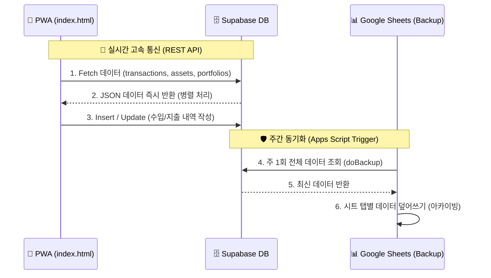

# 스마트 가계부 V2 (NetVisualizer_v02)

## 📌 개요
개인 가계부 및 자산 포트폴리오, 부동산 청약 관리를 위한 반응형 스마트 대시보드 웹앱입니다. 
초기에는 구글 스프레드시트를 백엔드로 사용했으나, **성능 최적화 및 렌더링 속도 향상**을 위해 메인 데이터베이스를 **Supabase (PostgreSQL)** 로 마이그레이션했습니다. 프론트엔드는 HTML/Vanilla JS 기반의 PWA(Progressive Web App)로 동작합니다.

---

## 🏗️ 시스템 아키텍처 및 데이터 파이프라인

이 어플리케이션은 **사용자 접근성(PWA) + 고속 렌더링(Supabase) + 안전한 백업(Google Sheets)** 의 3단계 구조를 가집니다.



### 1. 프론트엔드 (Frontend) - `index.html`
- 단일 페이지 어플리케이션(SPA)으로, 모든 비즈니스 로직(차트 렌더링, API Fetch, UI 조작)을 담당합니다.
- `Supabase JS SDK`를 직접 임베드하여 데이터베이스와 직접 통신(`select`, `insert`, `delete`)합니다.
- 오프라인 상태이거나 네트워크 불안정 시 로컬 스토리지(`localStorage`) 캐시 및 데모 데이터를 폴백으로 사용합니다.

### 2. 메인 백엔드 (Supabase) - `PostgreSQL`
- **transactions**: 수입/지출 내역 테이블 (날짜, 시간, 카테고리, 금액 등)
- **assets**: 월별 자산 추이 테이블 (순자산, 현금, 안전자산, 투자자산, 부채)
- **portfolios**: 현재 투자/보유 자산 포트폴리오 테이블

### 3. 백업 스토리지 (Google Apps Script) - `code.gs`
- 기존 백엔드에서 **주간 백업 스크립트**로 역할이 변경되었습니다.
- 구글 앱스 스크립트의 **시간 기반 트리거**가 `doBackup()` 함수를 실행하여 Supabase의 최신 데이터를 구글 시트에 복사해 둡니다.

---

## 🔄 주요 프로세스 및 최신 기능

### 1. 초고속 데이터 동기화
- 사용자가 앱에 접속하면 `index.html`이 Supabase API를 통해 3개의 테이블을 병렬(`Promise.all`)로 비동기 로딩하여, 로딩 지연 없는 네이티브 수준의 속도를 제공합니다.

### 2. 부동산 청약 및 대출 시뮬레이션
- **부동산 청약 탭**에서 주요 신도시 예상 분양가 및 위치를 지도(Leaflet.js)로 제공합니다.
- 사용자의 가용 자금(현금성 자산 + 예상 대출금액)을 기반으로 달성률 프로그레스 바를 렌더링합니다.

### 3. 투자 자산 상세 보기
- 포트폴리오의 각 자산을 배당주, 지수추종, 성장주 등으로 자동 분류하여 비중(Doughnut 차트)과 보유 수량, 평가 금액을 아코디언 UI로 제공합니다.

### 4. 거래 내역 작성 및 포트폴리오 편집
- 우측 하단의 플로팅 버튼으로 내역을 입력하면 Supabase의 `transactions` 테이블에 실시간 Insert 됩니다.
- 포트폴리오 화면에서 데이터를 편집할 수 있습니다.

---

## 🚀 개발 및 테스트 가이드

1. **로컬 테스트 환경 구동**
   - 프로젝트 디렉토리 안에서 로컬 서버를 실행합니다:
     ```bash
     npx http-server -p 8080
     ```
   - 브라우저에서 `http://localhost:8080` 으로 접속합니다.
   
2. **Supabase 설정**
   - `index.html` 하단부에 `SUPABASE_URL`과 `SUPABASE_KEY` 상수가 하드코딩되어 있습니다. 환경이 바뀔 경우 이 키를 교체하세요.

3. **Google Sheets 자동 백업 설정**
   - 구글 앱스 스크립트 에디터 좌측의 **트리거(시계 아이콘)** 메뉴에서 `doBackup` 함수를 **시간 기반 트리거(예: 매주 월요일 오전)** 로 등록해 두어야 백업이 작동합니다.
