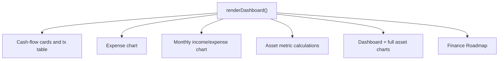
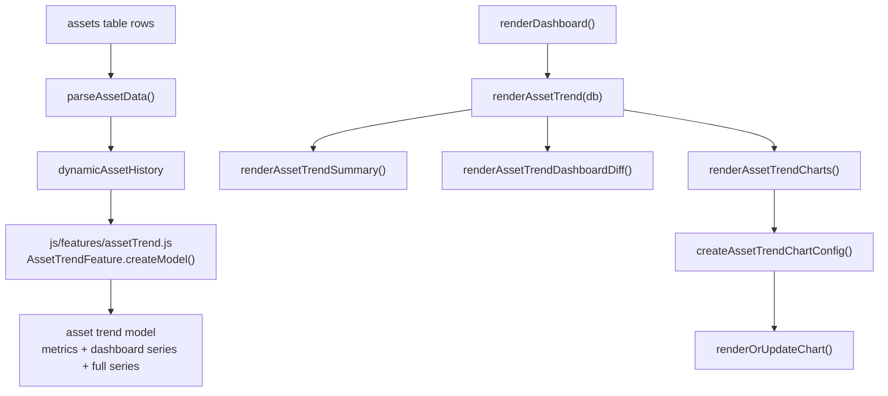
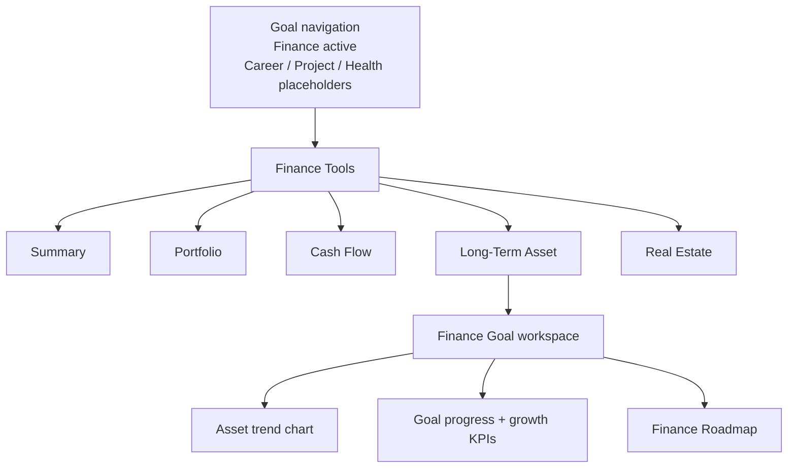

# Asset Trend Redesign Slice

Date: 2026-06-06
Branch: `codex/asset-trend-redesign`

## Goal

Use the long-term asset trend screen as the first architecture redesign slice. This slice now has two parts:

- Separate asset-trend data modeling from `renderDashboard()` so the feature can later move into a full module.
- Start the visible two-level workspace layout: Goal first, then the tools inside that goal.

## Before

Problems:

- Long-term asset calculations were embedded inside the large dashboard renderer.
- The dashboard mini chart and full asset trend chart shared inline chart-building logic.
- Asset trend data selection was mixed with DOM writes and Chart.js config.

## After This Slice

## Visible Layout

The mobile layout mirrors the same hierarchy with a small Goal selector above the scroll area and a bottom tool bar for the active Finance goal.

## Current Boundary

Moved out of `index.html`:

- Current-year dashboard asset series generation
- Full asset trend series generation
- Goal progress calculations
- Baseline asset calculations
- Month-difference model values

Still inside `index.html`:

- DOM updates
- Chart.js configuration
- Chart lifecycle calls
- Finance Roadmap updates
- Goal/Tool navigation markup and event handling

## Why This Boundary

This keeps the first slice low-risk. The new feature file is pure model logic and does not touch Supabase, localStorage, Chart.js, or the DOM. The visible layout change stays in `index.html`, so no build system or framework migration is required.

## Next Candidate Steps

1. Move asset trend chart config into the feature boundary.
2. Move asset trend DOM renderers into a screen controller.
3. Promote Goal/Tool navigation into a small app-shell controller before adding Career, Project, or Health.
4. Add a small fixture-based regression test for `AssetTrendFeature.createModel()`.
5. Repeat the pattern for cash-flow import or portfolio detail after this screen is stable.
