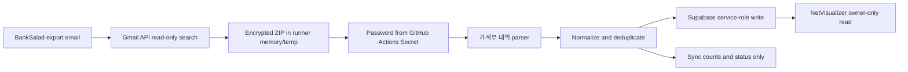

# BankSalad Gmail Auto Sync Design

## Decision

Use a scheduled GitHub Actions worker. The static GitHub Pages frontend cannot
monitor Gmail while the browser is closed. GitHub Actions provides an ephemeral
background runner without requiring the user's PC to remain powered on.

## Data Flow



## Runtime

- Trigger: every 15 minutes and manual `workflow_dispatch`.
- Mail query: exact BankSalad sender, ZIP attachment, recent time window.
- Gmail scope: `https://www.googleapis.com/auth/gmail.readonly` only.
- Runner: GitHub-hosted Ubuntu, destroyed after each job.
- Workbook libraries: `pyzipper` and `openpyxl`.
- Database transport: Supabase REST with service-role authentication.

## Secret Inventory

| Secret | Purpose | Stored in repository? |
| --- | --- | --- |
| `GMAIL_OAUTH_CLIENT_ID` | OAuth client identity | No |
| `GMAIL_OAUTH_CLIENT_SECRET` | OAuth client secret | No |
| `GMAIL_OAUTH_REFRESH_TOKEN` | Offline Gmail read token | No |
| `BANKSALAD_ZIP_PASSWORD` | Export ZIP decryption | No |
| `SUPABASE_URL` | Project endpoint | Actions Secret |
| `SUPABASE_SERVICE_ROLE_KEY` | Server-only database write | No |
| `NETVISUALIZER_OWNER_USER_ID` | Target owner UUID | Actions Secret |

Secrets are never accepted as command-line arguments by the worker and are
never written to logs. The workflow masks GitHub secrets automatically.

## Message Selection

The worker searches Gmail with:

```text
from:export-noreply@banksalad.com has:attachment filename:zip newer_than:30d
```

It recursively walks the MIME payload and accepts only `.zip` attachments.
Gmail messages are not marked read, labeled, archived, or deleted. A completed
message ID in `banksalad_sync_runs` is the processing checkpoint.

## Worksheet Selection

Each workbook sheet receives:

- header score for recognized transaction columns;
- a name bonus for `가계부`, `거래`, or `내역`;
- a small compatibility bonus for the second worksheet.

The highest-scoring sheet with a valid header row is selected. This matches the
observed BankSalad workbook where `뱅샐현황` is first and `가계부 내역` is second.

## Normalization

Output transaction fields remain compatible with NetVisualizer:

```text
date, time, type, category, subcategory, memo,
amount, currency, method, user_id
```

- `지출` is always negative.
- `수입` is always positive.
- `이체` preserves the exported sign.
- `카드대금`, `내계좌이체`, savings, and repayment categories keep their
  BankSalad type/category instead of being rewritten as consumption.
- Blank optional values use safe text fallbacks; invalid dates and zero amounts
  are rejected.

## Idempotency

Two checkpoints are used:

1. `banksalad_sync_runs.gmail_message_id` prevents reprocessing a completed
   email.
2. `transactions.dedupe_key` is a SHA-256 digest of normalized transaction
   fields and prevents overlapping rolling exports from inserting the same row.

Legacy rows without a digest are queried and compared with the same normalized
field contract before insert. Exact duplicate workbook rows are removed before
the database request.

## Privacy and Access

- Raw attachments and decrypted workbooks are never uploaded as artifacts.
- Temporary files are deleted with the runner workspace.
- Audit rows contain counts, timestamps, Gmail message ID, an attachment-name
  hash, status, and a sanitized error code only.
- The frontend's Supabase Auth gate is re-enabled.
- Personal tables use `auth.uid() = user_id` policies for browser access.
- Only the server worker uses the service role.

## Failure Model

| Failure | Result |
| --- | --- |
| Gmail authorization expired | Workflow fails; no DB write |
| No matching mail | Successful no-op |
| Wrong ZIP password | Failed audit row; no transaction write |
| Workbook schema changed | Failed/partial audit with invalid counts |
| Supabase unavailable | Job fails; message remains retryable |
| Duplicate email or export overlap | Successful no-op for duplicates |

## Rollback

- Disable the scheduled workflow.
- Revoke the Gmail OAuth grant.
- Remove the seven Actions secrets.
- Transactions imported by this worker can be identified with
  `source = 'banksalad_gmail'` and `source_message_id`.
- The migration is additive for transaction provenance and sync audit tables.
