# Current Architecture Map

Date: 2026-06-06
Branch: `codex/asset-trend-redesign`

## Purpose

This document maps the current NetVisualizer structure before any architecture redesign. It describes what exists today, not the desired future shape.

The current app is a static PWA built around one large `index.html` file. Most UI, state, Supabase reads/writes, parsing, chart rendering, transaction import, portfolio editing, real-estate views, and Quant workflows are implemented in that single file. The main exception is the Supabase Edge Function for market price sync. The first redesign slice now extracts long-term asset trend model logic into `js/features/assetTrend.js` and starts a visible two-level workspace layout.

## File-Level Map

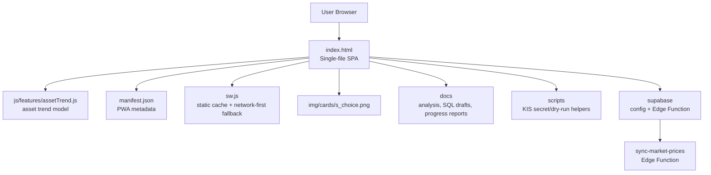

## Runtime Container Diagram

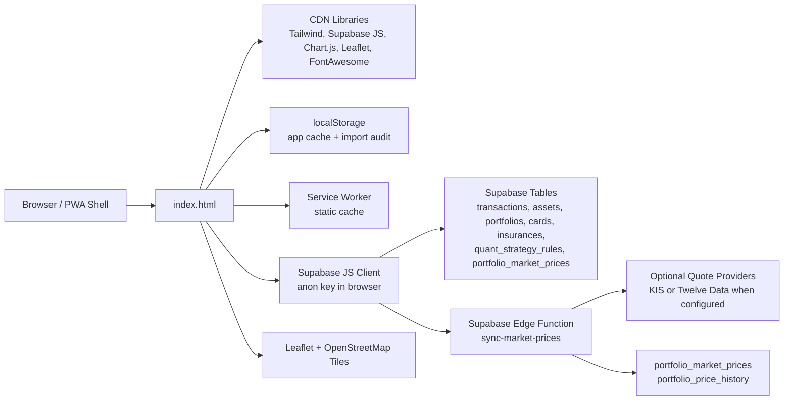

## Current Navigation Shape

The app is moving away from one flat tab list. The first visible step keeps all existing Finance screens but places them under a Goal layer.

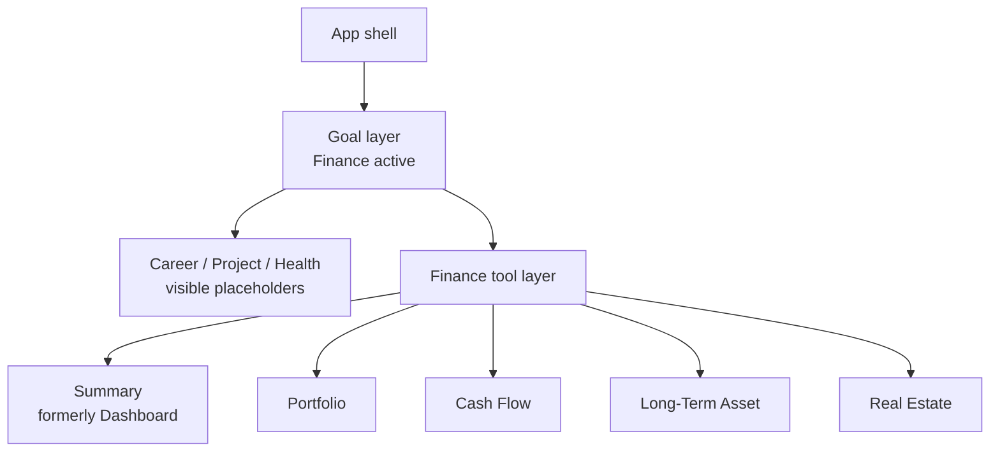

Current limitation: only Finance is interactive. The other goal buttons are intentionally disabled placeholders until their data model and tool sets are designed.

## Current SPA Internal Shape

These are logical areas inside `index.html`; they are not separate modules yet.

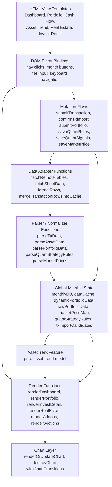

## Startup And Read Flow

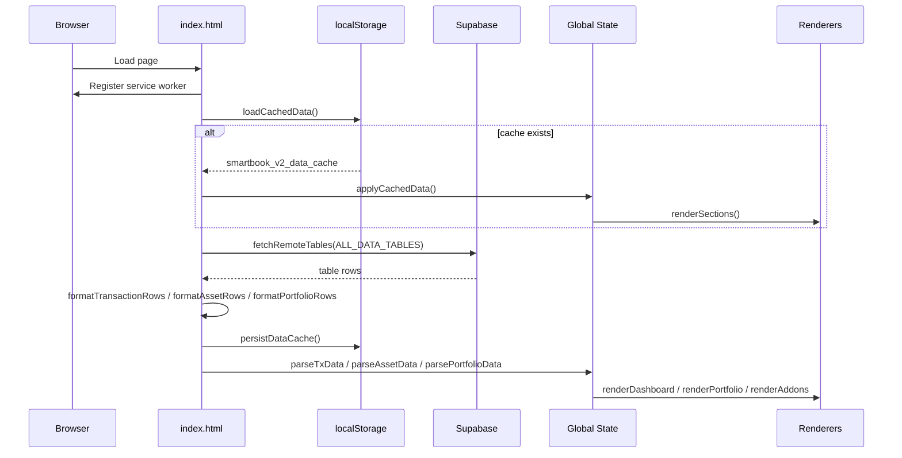

## State And Storage Map

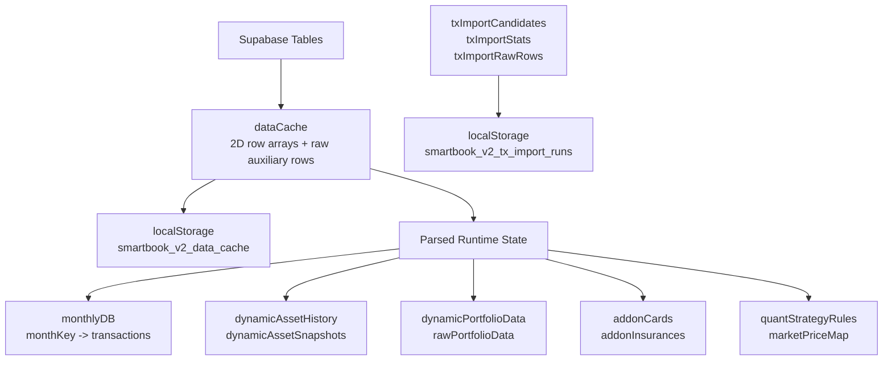

## Screen Dependency Map

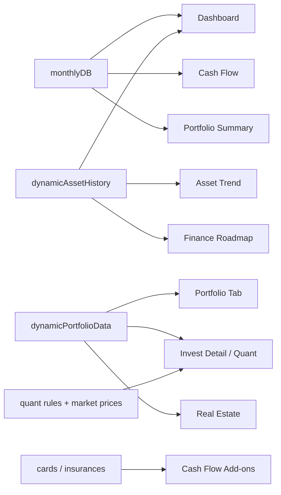

## Current Write Paths

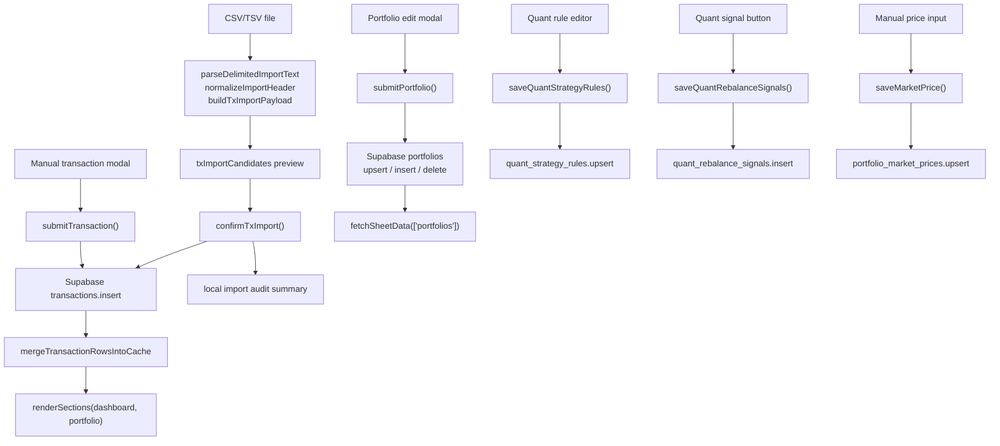

## Market Price Sync Flow

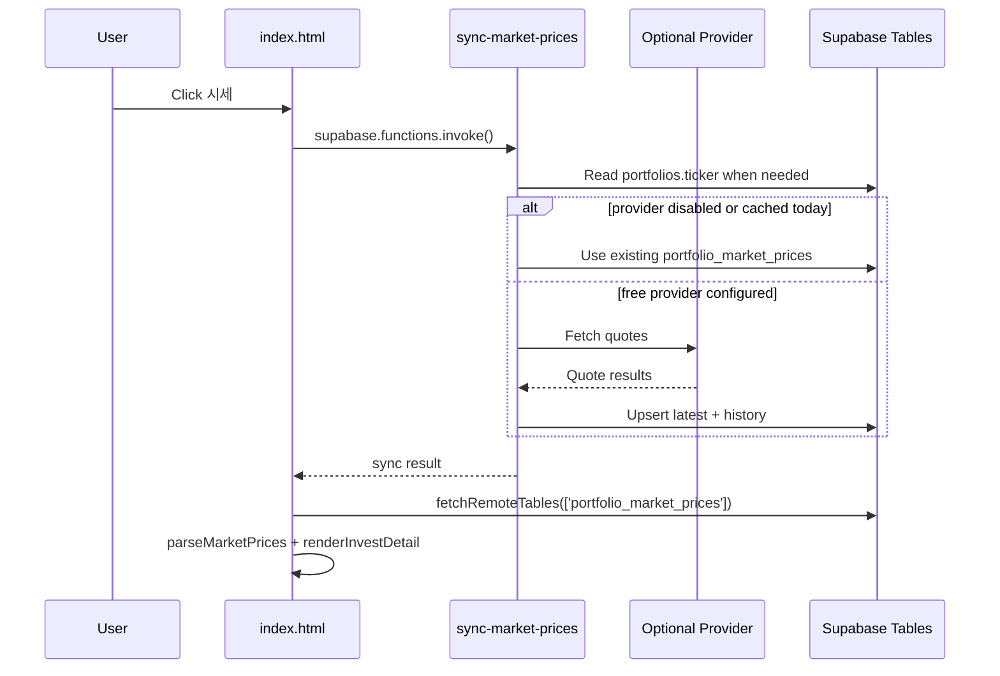

## Supabase Table Usage

| Table | Current use |
| --- | --- |
| `transactions` | Cash-flow rows, dashboard income/expense, manual transaction insert, CSV/TSV import insert |
| `assets` | Monthly asset trend and dashboard asset cards |
| `portfolios` | Portfolio accordion, asset classification, Quant metadata, real-estate funding status |
| `cards` | Cash-flow add-on card list |
| `insurances` | Cash-flow add-on insurance list |
| `quant_strategy_rules` | Strategy targets, bands, trigger labels |
| `portfolio_market_prices` | Latest manual/API market prices by ticker |
| `portfolio_price_history` | Written by Edge Function for historical price cache |
| `quant_rebalance_signals` | Written when saving Quant rebalance suggestions |

Drafted but not applied for realtime DB sync:

| Draft table | Intended future use |
| --- | --- |
| `account_sync_sources` | Provider/source metadata without raw account numbers |
| `account_sync_runs` | Server-side import/sync run audit trail |
| `transaction_import_candidates` | Server-side staging before confirmed transaction insert |

## Current Coupling Hotspots

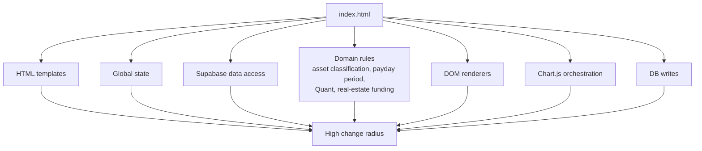

Key redesign pressure points:

- `index.html` mixes view markup, state, API access, domain calculations, mutation flows, chart setup, and event binding.
- Runtime state is mostly global mutable variables, so feature boundaries are implicit.
- Supabase row objects are converted into legacy two-dimensional arrays, then parsed back into feature-specific objects.
- Rendering functions depend on shared global state rather than explicit inputs.
- Mutation flows update remote DB, local cache, parsed state, and UI in the same function.
- Local cache and local import audit are useful but currently hidden behind direct `localStorage` calls.
- Edge Function is already a clean external boundary and can serve as a model for future server-side sync.

## Redesign Boundary Candidates

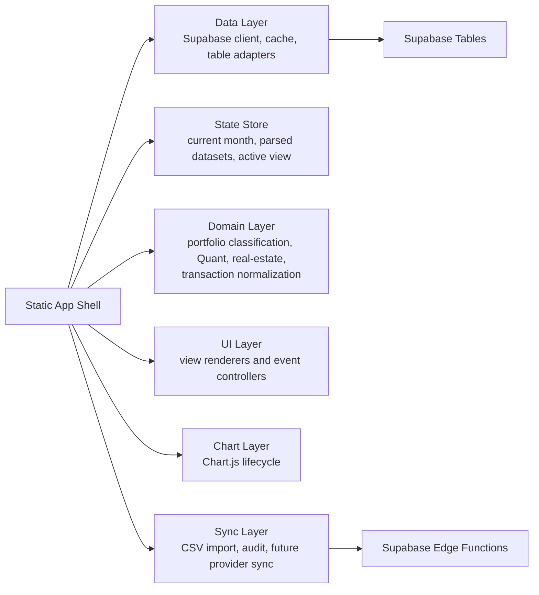

This boundary proposal is only a map for discussion. The next redesign decision should choose whether to keep a static vanilla app with separated JS modules or move to a framework-based app structure.
