# Current Architecture Map

Date: 2026-07-17
Branch: `main` (working tree)

## Purpose

This document maps the current NetVisualizer structure before any architecture redesign. It describes what exists today, not the desired future shape.

## 2026-07-17 Finance Repository Boundary

`js/features/financeRepository.js` now owns finance-table query specifications, selected columns, optional-table behavior, object-row normalization, and the read-only finance snapshot. `appCore.js` provides the Supabase client and projects repository objects into legacy view state; it no longer builds table queries or converts server rows into spreadsheet-shaped arrays.

Finance Home and Personal CFO calculations prefer repository portfolio rows. The portfolio editor uses a named-field `PortfolioDraft` with stable client keys, and all portfolio writes run through repository commands. Old cached arrays are migrated only when read.

Current script order is contractual: `appUtils` -> `financeRepository` -> `financeModel` -> generated Personal CFO domain -> `appCore` -> feature renderers -> `appShell`.

## 2026-07-15 Runtime Boundary Update

The app still runs as a static classic-JavaScript PWA, but the first high-risk shared rules now have explicit owners.

| Concern | Runtime owner | Rule |
| --- | --- | --- |
| HTML escaping, date/money formatting, lazy assets | `js/shared/appUtils.js` | Feature files call `window.AppUtils` or `window.AppAssets`; do not add another formatter or CDN loader. |
| Supabase finance reads and object cache | `js/features/financeRepository.js` | Owns table contracts and returns normalized object rows; calculations do not build Supabase queries. |
| Official assets, liabilities, net worth, source label, decision items | `js/features/financeModel.js` | Finance Home and Personal CFO use the same repository-row-first snapshot. |
| Finance dashboard rendering | `js/features/financeViews.js` | Historical asset snapshots remain a trend source, not the official current balance. |
| Portfolio rendering | `js/features/portfolioViews.js` | Displays the official snapshot and its freshness badge. |
| Personal CFO domain | `src/features/personal-cfo/` -> `js/generated/personal-cfo-domain.js` | Owns types, mock defaults, portfolio/cash-flow adapters, calculations, scoring, and three graph builders. |
| Personal CFO renderer | `js/features/personalCfo.js` | Owns DOM/SVG rendering, local/remote snapshot persistence, and graph-mode interaction. It must not duplicate domain calculations. |
| Life Today dashboard | `js/features/lifeDashboard.js` | Reads public snapshots from Checklist, Health, and Personal CFO modules. |
| Todo and Health persistence | `js/features/checklist.js`, `js/features/healthTracker.js` | Feature modules own their local/server state and expose read-only dashboard snapshots. |

`tools/check-ui-contract.mjs` verifies the critical script order.

SheetJS and Leaflet are no longer startup dependencies. `AppAssets.ensureXlsx()` loads SheetJS only when importing a workbook, and `AppAssets.ensureLeaflet()` loads the map runtime only when opening Real Estate.

The Personal CFO TypeScript tree is now the browser domain runtime. Vite builds it as an IIFE bundle so the static PWA can load `window.PersonalCfoDomain` without converting the whole app at once. `tools/check-personal-cfo-runtime.mjs` protects open/closed period selection, portfolio classification, net-worth math, graph-mode separation, and flow conservation.

Authentication is intentionally undecided. The current anonymous Supabase mode is acceptable only for local, single-user use and must not be treated as safe for a public deployment.

The current app remains a static PWA with a large `index.html`, but runtime behavior is split across feature files, an object repository, and the generated TypeScript domain bundle. The main remaining finance-shell calculation is payday accounting-period construction.

## 2026-07-16 Personal CFO Runtime

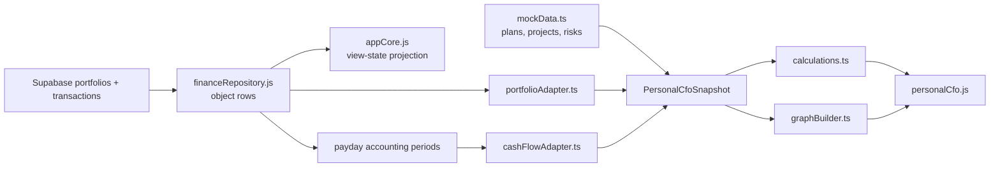
```mermaid
flowchart LR
    Supabase["Supabase portfolios + transactions"] --> Repository["financeRepository.js\nobject rows"]
    Repository --> Core["appCore.js\nview-state projection"]
    Repository --> PortfolioAdapter["portfolioAdapter.ts"]
    Repository --> PeriodState["payday accounting periods"]
    PeriodState --> CashFlowAdapter["cashFlowAdapter.ts"]
    Mock["mockData.ts\nplans, projects, risks"] --> Snapshot["PersonalCfoSnapshot"]
    PortfolioAdapter --> Snapshot
    CashFlowAdapter --> Snapshot
    Snapshot --> Calculations["calculations.ts"]
    Snapshot --> Graphs["graphBuilder.ts"]
    Calculations --> Renderer["personalCfo.js"]
    Graphs --> Renderer
```

The graph has three explicit modes:

| Mode | Data scope | Rule |
| --- | --- | --- |
| `balanceSheet` | Current portfolio balances | Default view. Account, asset, and liability stocks contribute to or reduce net worth. Income flows are excluded. |
| `cashFlow` | Latest closed payday period | Income is allocated to actual expense/saving buckets, debt repayment, and residual cash. Open periods are excluded. |
| `strategy` | Manual plan snapshot | Budget buckets fund two projects and hedge risks. It is a planning model, not a statement of actual balances. |

Every desktop graph uses explicit vertical columns. The first node in each column shares a `y=92` top line. Edges use the node-center port and one shared middle axis; collision-avoidance fan offsets are intentionally disabled, so related arrows may overlap before branching. Column headings and subtle guide lines remain part of the SVG contract.

Finance Home follows a decision hierarchy: current net worth, latest closed free cash flow, asset-goal progress, housing self-funding, and at most three action items. Housing self-funding excludes pension, discounts market investments by 10%, and subtracts debt. Loan capacity is secondary context and is not counted as saved money.

## File-Level Map

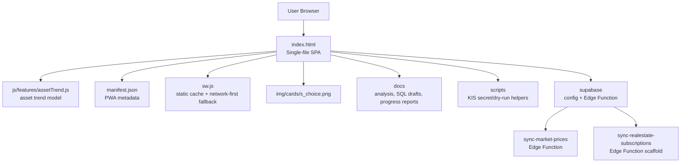
```mermaid
flowchart TD
    User["User Browser"] --> App["index.html\nSingle-file SPA"]
    App --> AssetTrendModule["js/features/assetTrend.js\nasset trend model"]
    App --> Manifest["manifest.json\nPWA metadata"]
    App --> SW["sw.js\nstatic cache + network-first fallback"]
    App --> CardImage["img/cards/s_choice.png"]

    App --> Docs["docs\nanalysis, SQL drafts, progress reports"]
    App --> Scripts["scripts\nKIS secret/dry-run helpers"]
    App --> SupabaseDir["supabase\nconfig + Edge Function"]

    SupabaseDir --> PriceFn["sync-market-prices\nEdge Function"]
    SupabaseDir --> RealEstateFn["sync-realestate-subscriptions\nEdge Function scaffold"]
```

## Runtime Container Diagram

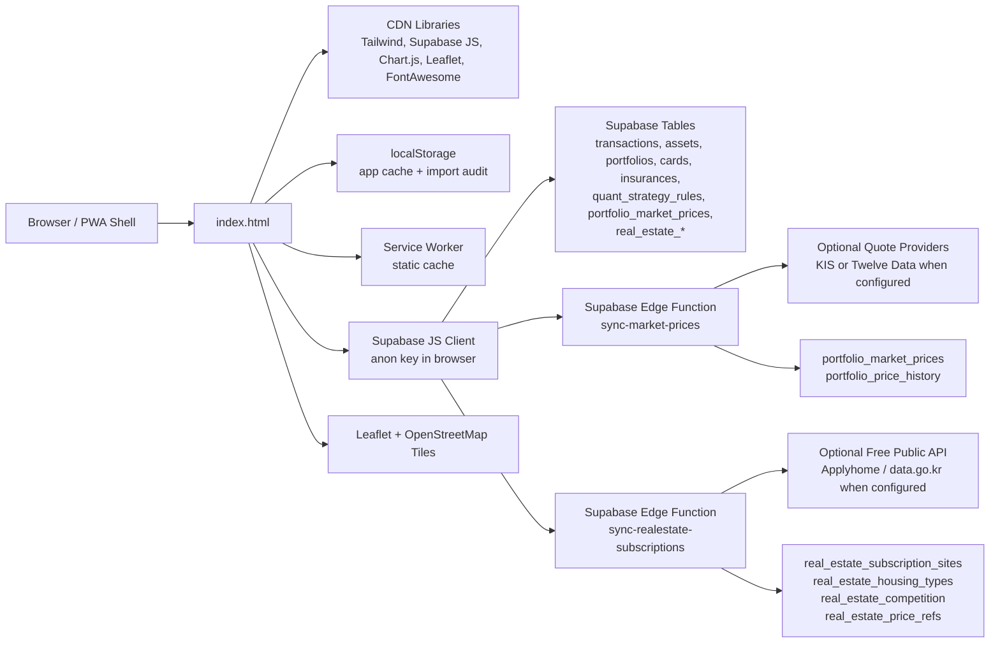
```mermaid
flowchart LR
    Browser["Browser / PWA Shell"] --> Index["index.html"]

    Index --> CDN["CDN Libraries\nTailwind, Supabase JS, Chart.js, Leaflet, FontAwesome"]
    Index --> LocalStorage["localStorage\napp cache + import audit"]
    Index --> ServiceWorker["Service Worker\nstatic cache"]

    Index --> SupabaseClient["Supabase JS Client\nanon key in browser"]
    SupabaseClient --> Tables["Supabase Tables\ntransactions, assets, portfolios, cards, insurances,\nquant_strategy_rules, portfolio_market_prices,\nreal_estate_*"]
    SupabaseClient --> EdgeFunction["Supabase Edge Function\nsync-market-prices"]
    SupabaseClient --> RealEstateEdge["Supabase Edge Function\nsync-realestate-subscriptions"]
    EdgeFunction --> PriceProviders["Optional Quote Providers\nKIS or Twelve Data when configured"]
    EdgeFunction --> PriceTables["portfolio_market_prices\nportfolio_price_history"]
    RealEstateEdge --> Applyhome["Optional Free Public API\nApplyhome / data.go.kr when configured"]
    RealEstateEdge --> RealEstateTables["real_estate_subscription_sites\nreal_estate_housing_types\nreal_estate_competition\nreal_estate_price_refs"]

    Index --> OpenStreetMap["Leaflet + OpenStreetMap Tiles"]
```

## Current Navigation Shape

The app is moving away from one flat tab list. The first visible step keeps all existing Finance screens but places them under a Goal layer.

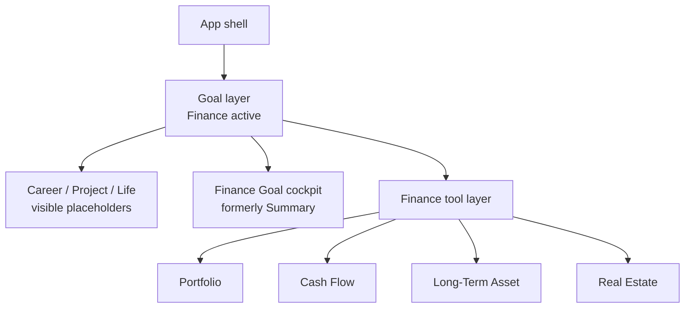
```mermaid
flowchart TD
    AppShell["App shell"] --> GoalLayer["Goal layer\nFinance active"]
    GoalLayer --> FutureGoals["Career / Project / Life\nvisible placeholders"]
    GoalLayer --> FinanceCockpit["Finance Goal cockpit\nformerly Summary"]
    GoalLayer --> FinanceTools["Finance tool layer"]

    FinanceTools --> Portfolio["Portfolio"]
    FinanceTools --> CashFlow["Cash Flow"]
    FinanceTools --> AssetTrend["Long-Term Asset"]
    FinanceTools --> RealEstate["Real Estate"]
```

Current limitation: only Finance is interactive. The other goal buttons are intentionally disabled placeholders until their data model and tool sets are designed.

## Finance Goal Cockpit KPIs

The Finance Goal screen is the first Finance-level cockpit rather than a separate tool tab.

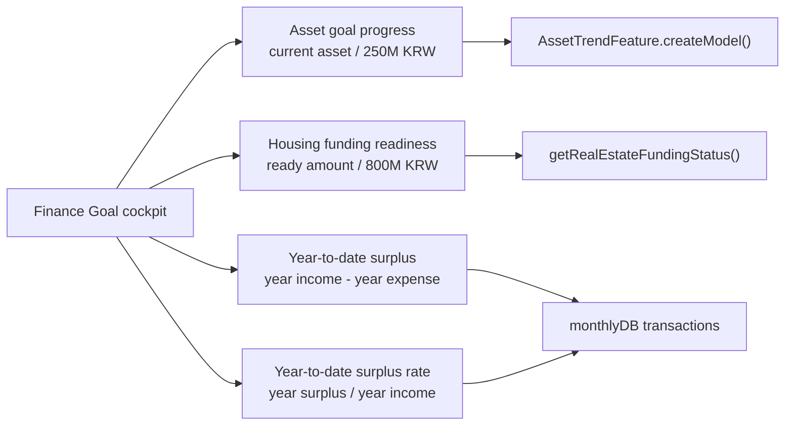
```mermaid
flowchart LR
    FinanceGoal["Finance Goal cockpit"] --> AssetGoal["Asset goal progress\ncurrent asset / 250M KRW"]
    FinanceGoal --> HousingFunding["Housing funding readiness\nready amount / 800M KRW"]
    FinanceGoal --> YearSurplus["Year-to-date surplus\nyear income - year expense"]
    FinanceGoal --> SurplusRate["Year-to-date surplus rate\nyear surplus / year income"]

    AssetGoal --> AssetTrendModel["AssetTrendFeature.createModel()"]
    HousingFunding --> RealEstateFunding["getRealEstateFundingStatus()"]
    YearSurplus --> MonthlyDB["monthlyDB transactions"]
    SurplusRate --> MonthlyDB
```

Visual structure:

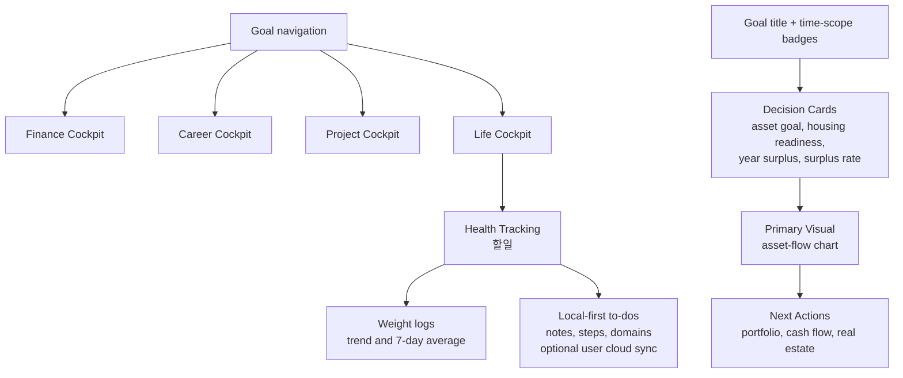
```mermaid
flowchart TD
    GoalNav["Goal navigation"] --> FinanceGoal["Finance Cockpit"]
    GoalNav --> CareerGoal["Career Cockpit"]
    GoalNav --> ProjectGoal["Project Cockpit"]
    GoalNav --> LifeGoal["Life Cockpit"]
    LifeGoal --> LifeTools["Health Tracking\n할일"]
    LifeTools --> HealthTracker["Weight logs\ntrend and 7-day average"]
    LifeTools --> Checklist["Local-first to-dos\nnotes, steps, domains\noptional user cloud sync"]

    Header["Goal title + time-scope badges"] --> DecisionCards["Decision Cards\nasset goal, housing readiness,\nyear surplus, surplus rate"]
    DecisionCards --> PrimaryVisual["Primary Visual\nasset-flow chart"]
    PrimaryVisual --> NextActions["Next Actions\nportfolio, cash flow, real estate"]
```

Tool screens reuse the same reading order so each tool starts with scope, then decision cards, then the main visual or detail/action area.

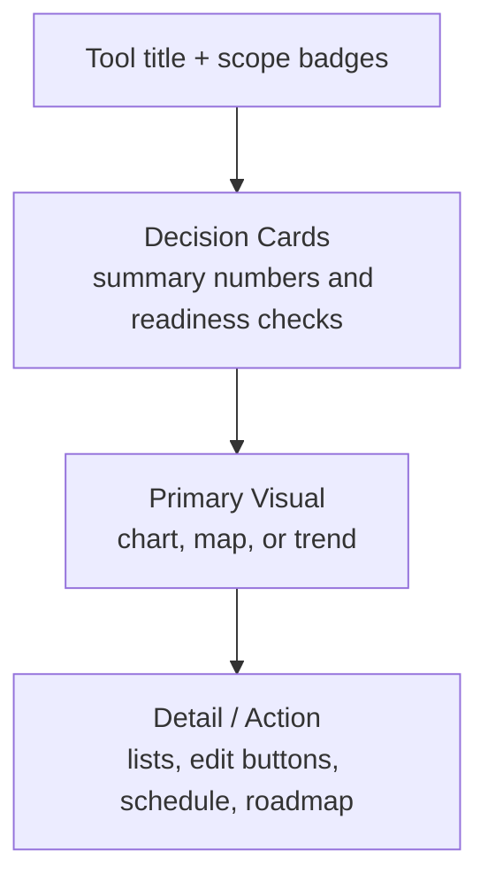
```mermaid
flowchart TD
    ToolHeader["Tool title + scope badges"] --> ToolDecision["Decision Cards\nsummary numbers and readiness checks"]
    ToolDecision --> ToolVisual["Primary Visual\nchart, map, or trend"]
    ToolVisual --> ToolDetail["Detail / Action\nlists, edit buttons, schedule, roadmap"]
```

Finance summary rules now live in `financeModel.js`, `financeViews.js`, and the Personal CFO TypeScript domain. Health and to-do modules expose dashboard snapshots instead of allowing Life Home to read their internal state directly.

## Current Time Scope

The app is starting to separate time scope by tool.

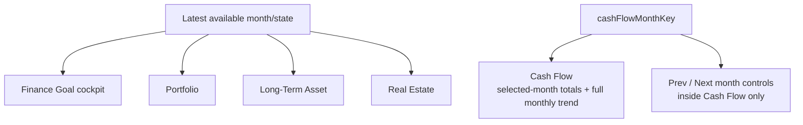
```mermaid
flowchart TD
    LatestState["Latest available month/state"] --> FinanceGoal["Finance Goal cockpit"]
    LatestState --> Portfolio["Portfolio"]
    LatestState --> AssetTrend["Long-Term Asset"]
    LatestState --> RealEstate["Real Estate"]

    CashFlowMonth["cashFlowMonthKey"] --> CashFlow["Cash Flow\nselected-month totals + full monthly trend"]
    CashFlowMonth --> MonthControls["Prev / Next month controls\ninside Cash Flow only"]
```

Implementation note: `currentMonthKey` still exists for compatibility with existing renderers. `cashFlowMonthKey` remembers the Cash Flow tool's selected month, while non-Cash-Flow tools reset to the latest available month when opened.

## Current SPA Internal Shape

These are logical areas inside `index.html`; they are not separate modules yet.

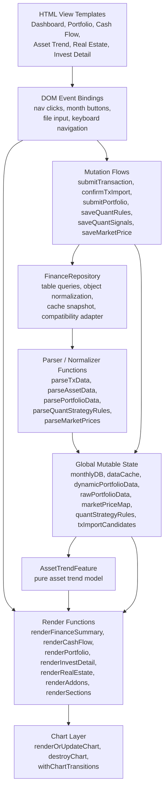
```mermaid
flowchart TD
    HtmlViews["HTML View Templates\nDashboard, Portfolio, Cash Flow,\nAsset Trend, Real Estate, Invest Detail"]

    State["Global Mutable State\nmonthlyDB, dataCache, dynamicPortfolioData,\nrawPortfolioData, marketPriceMap,\nquantStrategyRules, txImportCandidates"]

    AssetTrendModule["AssetTrendFeature\npure asset trend model"]

    Repository["FinanceRepository\ntable queries, object normalization,\ncache snapshot, compatibility adapter"]

    Parsers["Parser / Normalizer Functions\nparseTxData, parseAssetData,\nparsePortfolioData,\nparseQuantStrategyRules,\nparseMarketPrices"]

    Renderers["Render Functions\nrenderFinanceSummary, renderCashFlow,\nrenderPortfolio, renderInvestDetail,\nrenderRealEstate, renderAddons, renderSections"]

    ChartLayer["Chart Layer\nrenderOrUpdateChart, destroyChart,\nwithChartTransitions"]

    Mutations["Mutation Flows\nsubmitTransaction, confirmTxImport,\nsubmitPortfolio, saveQuantRules,\nsaveQuantSignals, saveMarketPrice"]

    Events["DOM Event Bindings\nnav clicks, month buttons,\nfile input, keyboard navigation"]

    HtmlViews --> Events
    Events --> Mutations
    Events --> Renderers
    Repository --> Parsers
    Parsers --> State
    State --> AssetTrendModule
    AssetTrendModule --> Renderers
    State --> Renderers
    Renderers --> ChartLayer
    Mutations --> Repository
    Mutations --> State
```

## Startup And Read Flow

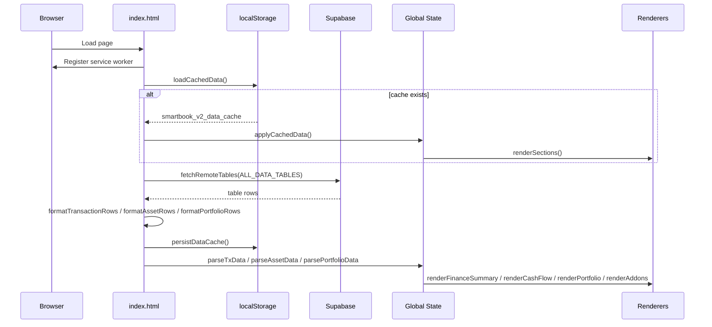
```mermaid
sequenceDiagram
    participant Browser
    participant Index as index.html
    participant Cache as localStorage
    participant Supabase
    participant State as Global State
    participant UI as Renderers

    Browser->>Index: Load page
    Index->>Browser: Register service worker
    Index->>Cache: loadCachedData()
    alt cache exists
        Cache-->>Index: smartbook_v2_data_cache
        Index->>State: applyCachedData()
        State->>UI: renderSections()
    end
    Index->>Supabase: fetchRemoteTables(ALL_DATA_TABLES)
    Supabase-->>Index: table rows
    Index->>Index: formatTransactionRows / formatAssetRows / formatPortfolioRows
    Index->>Cache: persistDataCache()
    Index->>State: parseTxData / parseAssetData / parsePortfolioData
    State->>UI: renderFinanceSummary / renderCashFlow / renderPortfolio / renderAddons
```

## State And Storage Map

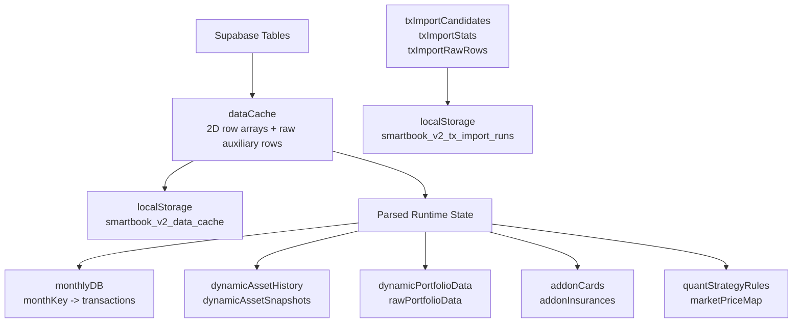
```mermaid
flowchart TD
    SupabaseTables["Supabase Tables"] --> DataCache["dataCache\n2D row arrays + raw auxiliary rows"]
    DataCache --> LocalDataCache["localStorage\nsmartbook_v2_data_cache"]
    DataCache --> ParsedState["Parsed Runtime State"]

    ParsedState --> MonthlyDB["monthlyDB\nmonthKey -> transactions"]
    ParsedState --> AssetState["dynamicAssetHistory\ndynamicAssetSnapshots"]
    ParsedState --> PortfolioState["dynamicPortfolioData\nrawPortfolioData"]
    ParsedState --> AddonState["addonCards\naddonInsurances"]
    ParsedState --> QuantState["quantStrategyRules\nmarketPriceMap"]

    ImportRuntime["txImportCandidates\ntxImportStats\ntxImportRawRows"] --> ImportAudit["localStorage\nsmartbook_v2_tx_import_runs"]
```

## Screen Dependency Map

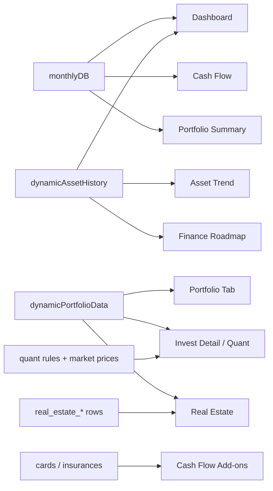
```mermaid
flowchart LR
    MonthlyDB["monthlyDB"] --> Dashboard["Dashboard"]
    MonthlyDB --> CashFlow["Cash Flow"]
    MonthlyDB --> PortfolioSummary["Portfolio Summary"]

    AssetState["dynamicAssetHistory"] --> Dashboard
    AssetState --> AssetTrend["Asset Trend"]
    AssetState --> Roadmap["Finance Roadmap"]

    PortfolioState["dynamicPortfolioData"] --> PortfolioTab["Portfolio Tab"]
    PortfolioState --> InvestDetail["Invest Detail / Quant"]
    PortfolioState --> RealEstate["Real Estate"]
    RealEstateTables["real_estate_* rows"] --> RealEstate

    AddonState["cards / insurances"] --> Addons["Cash Flow Add-ons"]
    QuantState["quant rules + market prices"] --> InvestDetail
```

## Current Write Paths

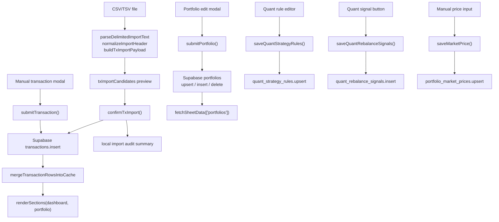
```mermaid
flowchart TD
    TxManual["Manual transaction modal"] --> SubmitTx["submitTransaction()"]
    SubmitTx --> TxInsert["Supabase transactions.insert"]
    TxInsert --> MergeTx["mergeTransactionRowsIntoCache"]
    MergeTx --> RenderTx["renderSections(dashboard, portfolio)"]

    CsvFile["CSV/TSV file"] --> ImportParser["parseDelimitedImportText\nnormalizeImportHeader\nbuildTxImportPayload"]
    ImportParser --> ImportPreview["txImportCandidates preview"]
    ImportPreview --> ConfirmImport["confirmTxImport()"]
    ConfirmImport --> TxInsert
    ConfirmImport --> ImportAudit["local import audit summary"]

    PortfolioEdit["Portfolio edit modal"] --> SubmitPortfolio["submitPortfolio()"]
    SubmitPortfolio --> PortfolioWrites["Supabase portfolios\nupsert / insert / delete"]
    PortfolioWrites --> FetchPortfolio["fetchSheetData(['portfolios'])"]

    QuantRules["Quant rule editor"] --> SaveRules["saveQuantStrategyRules()"]
    SaveRules --> RulesUpsert["quant_strategy_rules.upsert"]

    QuantSignals["Quant signal button"] --> SaveSignals["saveQuantRebalanceSignals()"]
    SaveSignals --> SignalInsert["quant_rebalance_signals.insert"]

    PriceInput["Manual price input"] --> SavePrice["saveMarketPrice()"]
    SavePrice --> PriceUpsert["portfolio_market_prices.upsert"]
```

## Market Price Sync Flow

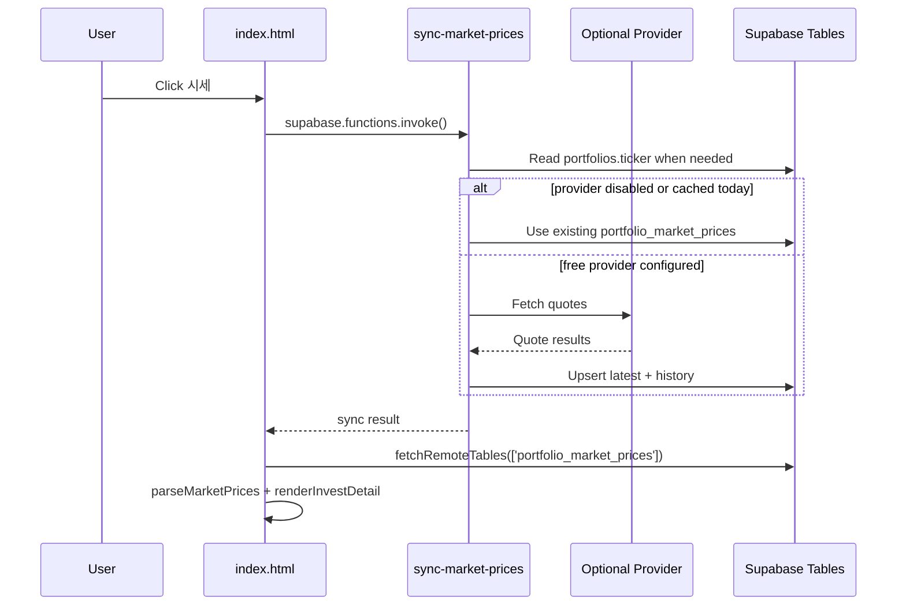
```mermaid
sequenceDiagram
    participant User
    participant Index as index.html
    participant Function as sync-market-prices
    participant Provider as Optional Provider
    participant DB as Supabase Tables

    User->>Index: Click 시세
    Index->>Function: supabase.functions.invoke()
    Function->>DB: Read portfolios.ticker when needed
    alt provider disabled or cached today
        Function->>DB: Use existing portfolio_market_prices
    else free provider configured
        Function->>Provider: Fetch quotes
        Provider-->>Function: Quote results
        Function->>DB: Upsert latest + history
    end
    Function-->>Index: sync result
    Index->>DB: fetchRemoteTables(['portfolio_market_prices'])
    Index->>Index: parseMarketPrices + renderInvestDetail
```

## Supabase Table Usage

| Table | Current use |
| --- | --- |
| `transactions` | Cash-flow rows, dashboard income/expense, manual transaction insert, CSV/TSV import insert |
| `assets` | Monthly asset trend and dashboard asset cards |
| `portfolios` | Portfolio accordion, asset classification, Quant metadata, real-estate funding status |
| `cards` | Cash-flow add-on card list |
| `insurances` | Cash-flow add-on insurance list |
| `quant_strategy_rules` | Strategy targets, bands, trigger labels |
| `portfolio_market_prices` | Latest manual/API market prices by ticker |
| `portfolio_price_history` | Written by Edge Function for historical price cache |
| `quant_rebalance_signals` | Written when saving Quant rebalance suggestions |
| `real_estate_subscription_sites` | Real Estate tab schedule cards and map markers; seeded with Goyang Changneung S2/S3/S4 |
| `real_estate_housing_types` | Future Applyhome housing-type supply and sale-price details |
| `real_estate_competition` | Future Applyhome competition and application rows |
| `real_estate_price_refs` | Future MOLIT apartment transaction references |

Drafted but not applied for realtime DB sync:

| Draft table | Intended future use |
| --- | --- |
| `account_sync_sources` | Provider/source metadata without raw account numbers |
| `account_sync_runs` | Server-side import/sync run audit trail |
| `transaction_import_candidates` | Server-side staging before confirmed transaction insert |

## Current Coupling Hotspots

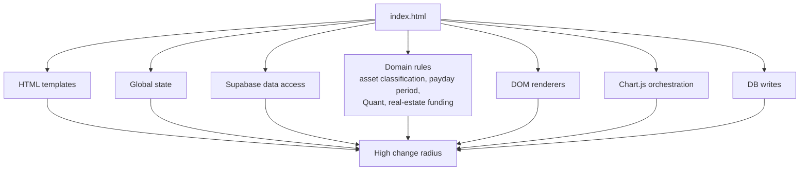
```mermaid
flowchart TD
    Index["index.html"] --> UI["HTML templates"]
    Index --> State["Global state"]
    Index --> Data["Supabase data access"]
    Index --> Domain["Domain rules\nasset classification, payday period,\nQuant, real-estate funding"]
    Index --> Render["DOM renderers"]
    Index --> Charts["Chart.js orchestration"]
    Index --> Mutations["DB writes"]

    UI --> Risk["High change radius"]
    State --> Risk
    Data --> Risk
    Domain --> Risk
    Render --> Risk
    Charts --> Risk
    Mutations --> Risk
```

Key redesign pressure points:

- `index.html` mixes view markup, state, API access, domain calculations, mutation flows, chart setup, and event binding.
- Runtime state is mostly global mutable variables, so feature boundaries are implicit.
- Finance reads and portfolio edit drafts stay as named objects. Indexed legacy rows are accepted only while migrating an old cache.
- Rendering functions depend on shared global state rather than explicit inputs.
- Mutation flows update remote DB, local cache, parsed state, and UI in the same function.
- Local cache and local import audit are useful but currently hidden behind direct `localStorage` calls.
- Edge Function is already a clean external boundary and can serve as a model for future server-side sync.

## Redesign Boundary Candidates

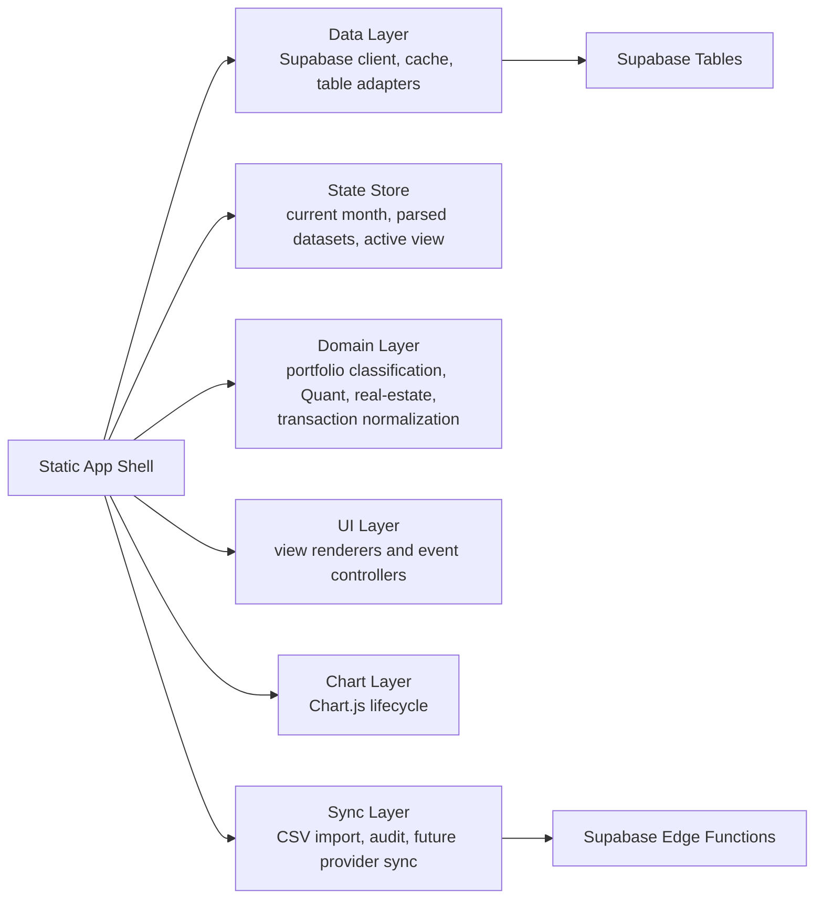
```mermaid
flowchart LR
    StaticApp["Static App Shell"] --> DataLayer["Data Layer\nSupabase client, cache, table adapters"]
    StaticApp --> StateStore["State Store\ncurrent month, parsed datasets, active view"]
    StaticApp --> DomainLayer["Domain Layer\nportfolio classification, Quant, real-estate,\ntransaction normalization"]
    StaticApp --> UILayer["UI Layer\nview renderers and event controllers"]
    StaticApp --> ChartLayer["Chart Layer\nChart.js lifecycle"]
    StaticApp --> SyncLayer["Sync Layer\nCSV import, audit, future provider sync"]

    SyncLayer --> EdgeFunctions["Supabase Edge Functions"]
    DataLayer --> Supabase["Supabase Tables"]
```

This boundary proposal is only a map for discussion. The next redesign decision should choose whether to keep a static vanilla app with separated JS modules or move to a framework-based app structure.
