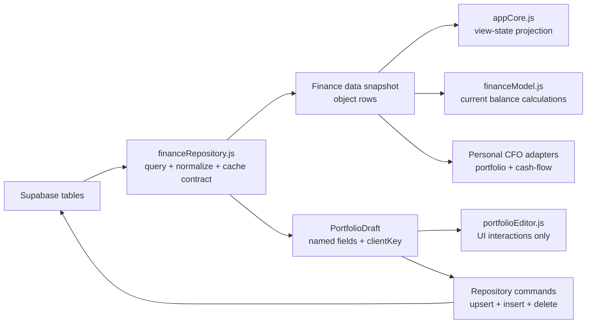

# FinanceRepository v1 Design

Date: 2026-07-17
Status: implemented

## Goal

Supabase 조회, 테이블별 선택 컬럼, 원시 행 정규화가 `appCore.js`와 계산 코드에 흩어지지 않도록 하나의 데이터 접근 경계로 모은다. 화면과 계산은 Supabase 쿼리 빌더가 아니라 객체 스냅샷을 입력으로 받는다.

## Runtime Boundary

## Ownership

| Owner | Responsibility |
| --- | --- |
| `js/features/financeRepository.js` | Table specs, Supabase reads, object cache, PortfolioDraft creation, mutation payloads, and portfolio write commands |
| `js/features/appCore.js` | Supabase client/session provider, cache persistence, object rows to legacy render state, and thin period-domain delegation |
| `src/features/finance/paydayAccounting.ts` | Payday overrides, weekend fallback, and accounting-period boundaries |
| `js/features/financeModel.js` | Net worth and decision calculations from object portfolio rows |
| `js/features/financeViews.js` | Presentation and chart rendering from model outputs |
| `js/features/personalCfo.js` | CFO rendering; repository snapshot is preferred over grouped UI state |

## PortfolioDraft Rule

The repository cache and editor draft both store named objects. Old two-dimensional cache rows are accepted only as a read-time migration input. Draft items use a stable `clientKey`, so UI handlers do not depend on the item's array position or database id. `portfolioEditor.js` enriches classification fields, then calls `savePortfolioDraft()`; it does not issue Supabase writes.

## Quality Gate

- `tools/check-finance-repository.mjs` verifies legacy migration, numeric normalization, PortfolioDraft changes, mutation planning, repository write order, query columns/order, and optional-table errors.
- `tools/check-domain-models.mjs` verifies object portfolio rows produce the same official balance.
- `tools/check-ui-contract.mjs` enforces repository-before-core script order.

## Next Boundary

The monthly CFO close boundary is now implemented. `FinanceRepository` reads optional `finance_month_closes` rows, normalizes them into runtime records, and exposes `saveFinanceMonthClose()` as the only cloud write command for the feature. The domain and UI do not issue Supabase queries directly.

The next repository boundary should move multi-row portfolio writes behind a server RPC or transaction so partial saves cannot leave the portfolio in a mixed state.
