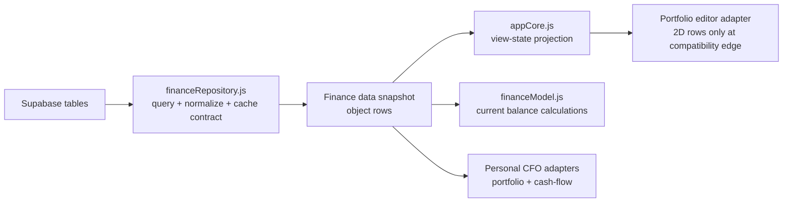

# FinanceRepository v1 Design

Date: 2026-07-17
Status: implemented

## Goal

Supabase 조회, 테이블별 선택 컬럼, 원시 행 정규화가 `appCore.js`와 계산 코드에 흩어지지 않도록 하나의 데이터 접근 경계로 모은다. 화면과 계산은 Supabase 쿼리 빌더가 아니라 객체 스냅샷을 입력으로 받는다.

## Runtime Boundary

## Ownership

| Owner | Responsibility |
| --- | --- |
| `js/features/financeRepository.js` | Table specs, selected columns, optional-table policy, Supabase reads, numeric normalization, object cache, read-only snapshot, accounting-period input, legacy portfolio adapter |
| `js/features/appCore.js` | Supabase client/session provider, cache persistence, payday period rule, object rows to legacy render state |
| `js/features/financeModel.js` | Net worth and decision calculations from object portfolio rows |
| `js/features/financeViews.js` | Presentation and chart rendering from model outputs |
| `js/features/personalCfo.js` | CFO rendering; repository snapshot is preferred over grouped UI state |

## Compatibility Rule

The repository cache stores arrays of objects. Old two-dimensional cache rows are accepted and normalized on read. Only `toLegacyPortfolioRows()` may create a two-dimensional portfolio table, because the current portfolio edit modal still edits by column index. New finance calculations must not consume that compatibility table.

## Quality Gate

- `tools/check-finance-repository.mjs` verifies legacy migration, numeric normalization, snapshot copying, transaction merge, accounting periods, query columns/order, and optional-table errors.
- `tools/check-domain-models.mjs` verifies object portfolio rows produce the same official balance.
- `tools/check-ui-contract.mjs` enforces repository-before-core script order.

## Next Boundary

Move portfolio mutation payloads from `portfolioEditor.js` into repository commands, then replace the editor's indexed rows with an object draft model. This is deliberately outside v1 so the read path can stabilize first.
