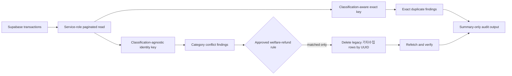

# Income Deduplication and Data Quality Design

## Decision

Use the existing GitHub Actions service-role boundary to audit and repair the
ledger. The browser remains an owner-facing viewer; database-wide inspection
and deletion stay in the ephemeral worker.

## Data Flow



## Identity Contract

The transaction fingerprint contains:

```text
date, time, type, amount, normalized memo,
normalized method, currency
```

`category` and `subcategory` are intentionally excluded. They may be corrected
without turning the same bank event into a new transaction.

For backward compatibility, the worker recomputes the current identity from
all fetched rows instead of trusting historical digest values created by the
older category-sensitive algorithm.

## Approved Repair Guardrails

A row is a deletion candidate only when all conditions hold:

1. type is `수입`;
2. memo normalizes to `복리후생환불`;
3. category is `기타수입`;
4. a `복지포인트` row exists with the same date, type, amount, normalized memo,
   normalized method, and currency;
5. the date is within the approved 2026-06-25 through 2026-07-23 salary period;
6. the deletion request uses explicit transaction UUIDs;
7. a post-delete audit confirms the approved candidate set is empty.

Time is omitted only for this approved repair matcher because one known copied
row changed `13:17:09` to `13:17:00`. The general ledger identity retains time.
Historical matching rows outside the approved period are counted separately and
are never deleted by this repair command.

## Audit Output

The worker prints and optionally saves only aggregate evidence:

- row and unique-ID counts;
- first and last transaction dates;
- exact duplicate group and excess-row counts;
- classification-conflict counts;
- missing/invalid field counts;
- source and month-level row counts;
- approved repair candidate count and financial impact.

Raw memos, methods, account identifiers, and transaction UUIDs are not emitted.

## Failure and Rollback

- A failed read or delete stops the job.
- A repair with zero candidates is successful and idempotent.
- Unrelated duplicate candidates are audit-only.
- Git rollback restores code; database repair rollback would require restoring
  the deleted legacy rows, which is unnecessary because equivalent retained
  `복지포인트` rows preserve every approved financial event.
