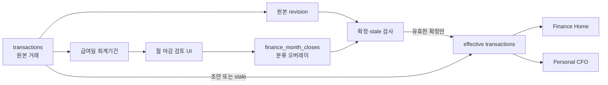

# Monthly CFO Close v1 Design

Date: 2026-07-17
Status: implemented

## Goal

급여일 기준 회계기간의 거래 분류를 검토하고 수정한 뒤, 사용자가 명시적으로 확정한 결과만 Finance Home과 Personal CFO 계산에 반영한다. 원본 거래는 계좌 이력의 원장으로 보존하고 월 마감은 별도 오버레이로 관리한다.

## Product Rules

- 진행 중인 급여기간은 분류를 미리 검토할 수 있지만 마감할 수 없다.
- 종료된 기간도 사용자가 확정하기 전에는 `기간 종료 · 분류 미확정` 상태다.
- 미분류 거래가 남아 있으면 마감을 차단한다.
- 확정된 분류만 Finance Home, Personal CFO KPI, 현금흐름 네트워크에 반영한다.
- 확정 후 원본 거래가 추가·수정되면 마감 레코드를 `분류 재확인 필요` 상태로 취급하고 오버레이 적용을 중단한다.
- 마감을 다시 열 수 있으며, 다시 연 기간은 재확정 전까지 초안으로 취급한다.
- Life 기능과 월 마감 상태는 연결하지 않는다.

## Data Flow

## Runtime Ownership

| Concern | Owner |
| --- | --- |
| 마감 레코드 생성, 정규화, revision, 분류 적용, 마감 가능 조건 | `src/features/finance/monthlyClose.ts` |
| 브라우저 검토 상태, 페이지네이션, 로컬 캐시, UI 이벤트 | `js/features/monthlyClose.js` |
| Supabase 조회·정규화·upsert | `js/features/financeRepository.js` |
| 급여기간 선택과 현금흐름 요약 | `src/features/personal-cfo/cashFlowAdapter.ts` |
| Finance Home 표시 | `js/features/financeViews.js` |
| Personal CFO KPI·그래프 표시 | `js/features/personalCfo.js` |

## Storage Contract

`finance_month_closes`는 사용자와 회계기간마다 한 행을 가진다.

| Column | Meaning |
| --- | --- |
| `user_id`, `period_key` | 사용자별 회계기간 고유 키 |
| `period_start`, `period_end` | 급여일 기준 기간 경계 |
| `status` | `open` 또는 `closed` |
| `classifications` | 거래 키별 type/category/subcategory 오버레이 |
| `source_revision` | 확정 시점 원본 거래 집합의 결정적 revision |
| `transaction_count` | 확정 시점의 원본 거래 수 |
| `closed_at`, `updated_at` | 확정 및 갱신 시각 |

현재 공개 단일 사용자 모드에서는 기존 public owner를 사용하고, 향후 인증을 도입하면 동일한 행 구조에서 `auth.uid()` 소유권으로 전환한다. 인증 정책이 정해지기 전까지 공개 배포를 개인정보 저장에 안전한 구조로 간주하지 않는다.

## UI Contract

- 월 마감 패널은 Cash Flow 상단에 위치한다.
- 접힌 상태에서는 기간, 진행/확정 가능/마감 상태, 거래 수, 미분류 수, 재분류 수만 보여준다.
- 검토 목록은 한 페이지 30건으로 제한해 대량 거래에서도 DOM 부하를 제어한다.
- type, category, subcategory를 수정할 수 있고 각 거래를 원본 분류로 되돌릴 수 있다.
- 클라우드 저장 실패 시 로컬 캐시를 유지하고 저장 상태를 명시한다.

## Quality Gates

- 도메인 테스트: 미분류 차단, 오버레이 적용, 마감, stale 감지, 재열기
- repository 테스트: 테이블 계약, transaction id, payload, merge
- runtime 테스트: 확정 상태가 현금흐름 요약과 KPI까지 전달되는지 확인
- UI 계약 테스트: 스크립트 순서, 패널, 저장·마감 연결
- 전체 `npm run check` 통과
