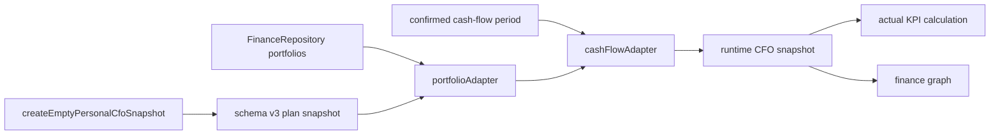

# Personal CFO Actual Source v1

Date: 2026-07-17
Status: implemented

## Goal

Personal CFO에서 seed 데이터를 완전히 제거한다. 계좌·자산·부채·소득·현금흐름은 Finance 실제 데이터에서만 만들고, 사용자 저장 스냅샷은 자금 계획·프로젝트·리스크·목표값만 보관한다.

## Source Rules

| Data | Source | Persistence |
| --- | --- | --- |
| 계좌·자산·부채 | FinanceRepository portfolio rows | Personal CFO에 복제 저장하지 않음 |
| 소득·지출·상환·잔여현금 | 최근 종료 급여기간 거래 | Personal CFO에 복제 저장하지 않음 |
| 거래 분류 | 확정된 Monthly CFO Close overlay | `finance_month_closes` |
| 자금 계획·프로젝트·리스크·목표 | 사용자 계획 | `personal_cfo_snapshots` schema v3 |

## Runtime Flow

## Schema v3 Migration

- 브라우저 저장 키를 `netvisualizer.personalCfo.snapshot.v3`로 변경한다.
- v2 로컬 스냅샷을 읽으면 기존 seed 바구니·프로젝트·리스크·KPI를 제거하고 v3로 저장한다.
- Supabase 행의 `schema_version`이 3보다 작으면 동일한 정규화를 적용한다.
- 사용자 정의 ID로 만든 프로젝트·리스크는 보존한다.
- 실제 계좌·자산·부채·소득·현금흐름은 모든 계획 스냅샷에서 제거한다.

## Empty States

- 계획 저축률과 비상금 커버리지는 임의의 0이 아니라 `미설정` 상태로 표시한다.
- 프로젝트와 리스크가 모두 없으면 하나의 간결한 빈 상태로 통합한다.
- 목표·리스크 네트워크는 계획 데이터가 없다는 상태를 표시한다.
- 실제 포트폴리오나 현금흐름이 없으면 실제 데이터 없음 상태를 표시한다.

## Quality Gates

- 생성 런타임에 `personalCfoMockSnapshot` export가 없어야 한다.
- 빈 스냅샷은 모든 재무·계획 collection이 비어 있어야 한다.
- v2 seed 제거와 사용자 정의 계획 보존을 테스트한다.
- seed 없이 실제 소득 및 자금 바구니 노드가 생성되어야 한다.
- 전체 `npm run check`를 통과해야 한다.
