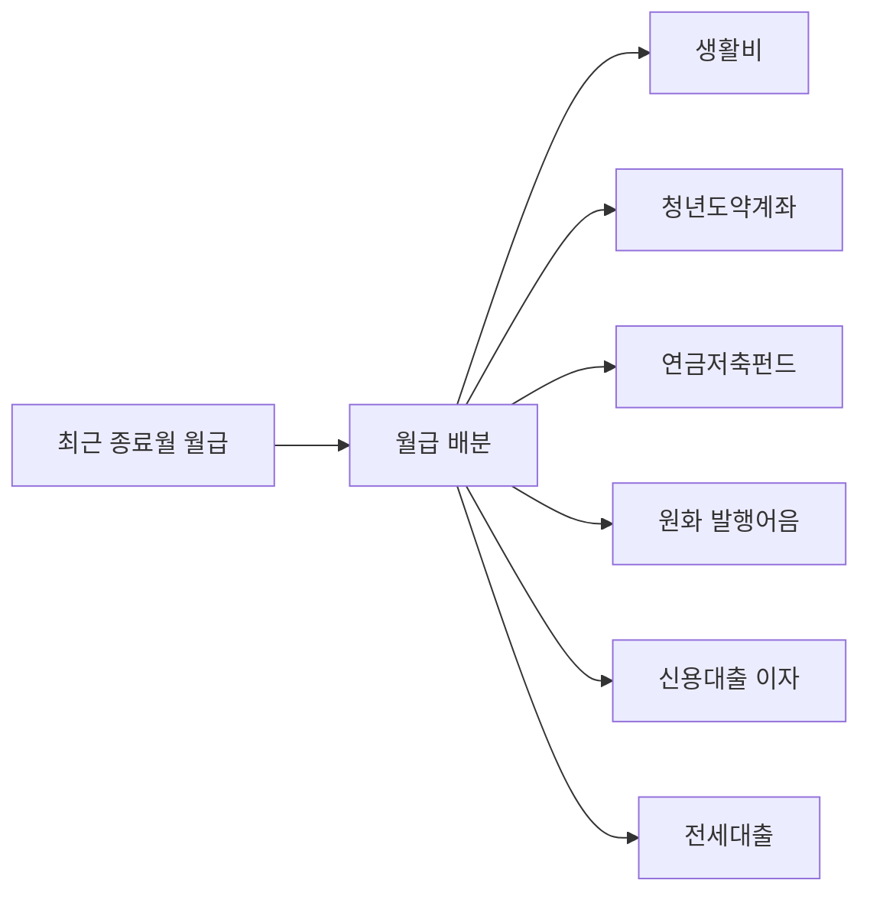

# Personal CFO Salary Flow v1

Date: 2026-07-17
Status: implemented

## Goal

최근 종료 급여기간의 실제 거래와 개인 배분 규칙을 결합해 월급이 어디로 이동하는지 보여준다. 전세대출 월 100만원은 현금흐름에만 포함하고 자산, 부채, 순자산, 부채비율에는 영향을 주지 않는다.

## Salary Allocation Rules

| Destination | Rule | Calculation role |
| --- | --- | --- |
| 청년도약계좌 | 월급통장에서 월 70만원 | 자산축적 |
| 연금저축펀드 | 월급일 부근의 짝 없는 10만원 이체 | 자산축적 |
| 신용대출 이자 | `상환 > 신용대출` 실제 금액 | 금융비용 |
| 전세대출 | `상환 > 전세대출` 월 100만원 | 현금흐름 전용 주거자금 |
| 생활비 | 월급통장·생활비통장 잔액 목표 합계 100만원 | 운영현금 단일 노드 |
| 원화 발행어음 | 위 배분 후 남은 월급 | 안전자산 |

```text
발행어음 배분액
= 월급
- 청년도약계좌
- 연금저축펀드
- 신용대출 이자
- 전세대출
- 월급통장 잔액 목표
- 생활비통장 잔액 목표
```

## Classification Boundaries

- 청년도약계좌의 출발 계좌 행만 계산하고 도착 계좌의 대응 행은 제외한다.
- 월급일 또는 다음 이틀의 10만원 출금 중 대응 입금이 없는 한 건을 연금저축으로 본다.
- 전세대출은 `housingLoanPayment`로 보관하며 `liabilities`에 추가하지 않는다.
- 신용대출 이자는 실제 부채 관련 현금유출로 유지한다.
- 통장별 50만원은 소비가 아니라 잔액 목표다.
- 발행어음 배분액은 실제 계좌 잔액이 아니라 월급 배분 규칙에 따른 값이다.

## Graph



모든 목적지는 같은 세로 열에 `생활비 → 저축 → 부채` 순서로 배치하고 수평·수직 꺾인선을 공유한다. 전세대출은 현금흐름 그래프에서 부채 노드로 표현하지만 재무상태 부채 계산에는 포함하지 않는다.

## Quality Gates

- 월급 배분 목적지 합계는 월급과 같아야 한다.
- 생활비 노드는 두 통장 잔액 목표를 합한 100만원이어야 한다.
- 전세대출 100만원은 cashflow liability 노드여야 하지만 부채비율을 바꾸지 않아야 한다.
- 중복 청년도약 거래는 70만원 한 번으로 계산해야 한다.
- 연금저축 10만원과 원화 발행어음 잔여액을 자동 계산해야 한다.
- TypeScript, CFO runtime, UI contract 검사를 통과해야 한다.
