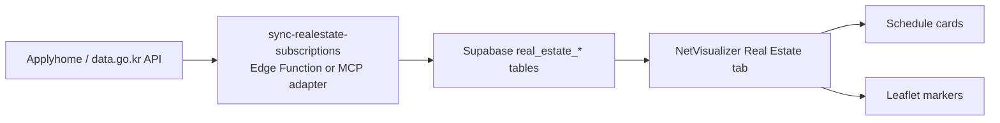

# Real Estate Data Sync Plan

Date: 2026-06-07
Branch: `codex/realestate-data-sync`

## Goal

Move the Real Estate / Subscription tab from hardcoded schedule data toward a Supabase-backed data model that can later be synchronized from free official public APIs or an agent-side MCP.

## Current Decision

Do not connect a real-estate MCP directly from the browser. MCP servers are better used by an agent, backend worker, or Supabase Edge Function-like sync layer. The browser should read normalized Supabase tables only.

## Data Model

| Table | Purpose |
| --- | --- |
| `real_estate_subscription_sites` | Main subscription blocks/sites such as Goyang Changneung S2/S3/S4. |
| `real_estate_housing_types` | Housing type, supply area, general/special supply counts, max sale price. |
| `real_estate_competition` | Competition and application rows by housing type/rank/residence area. |
| `real_estate_price_refs` | Apartment transaction references from MOLIT for future price comparison. |

The first migration seeds:

- `고양창릉 S-02`
- `고양창릉 S-03`
- `고양창릉 S-04`

## Frontend Behavior

`index.html` now reads the real-estate tables as optional tables:

- If `real_estate_subscription_sites` exists and has rows, cards and map markers use those rows.
- If the table is missing or empty, the app falls back to the existing S2/S3/S4 defaults.
- Real-estate table fetch failures are non-fatal, like optional Quant/add-on tables.

## Sync Function

`supabase/functions/sync-realestate-subscriptions` is a free-only scaffold.

Default behavior:

- `REALESTATE_SUBSCRIPTION_PROVIDER=disabled`
- No external API call is made.

API sync behavior:

- Set `REALESTATE_SUBSCRIPTION_PROVIDER=data-go-kr`.
- Set `DATA_GO_KR_SERVICE_KEY` or `ODCLOUD_SERVICE_KEY`.
- Call with `dryRun: true` first to inspect matched Applyhome rows.

## MCP Usage Policy

Community real-estate MCP servers can be useful for agent-side investigation or a local sync adapter, but they should be reviewed before installation:

- Check source code and dependencies.
- Keep API keys in server-side env vars only.
- Prefer official public APIs where available.
- Store normalized results in Supabase rather than making the UI depend on the MCP runtime.

## Next Steps

1. Apply the Supabase migration to the remote project.
2. Verify the seeded S2/S3/S4 rows render in the Real Estate tab.
3. Issue a free data.go.kr / ODcloud key for Applyhome.
4. Run the Edge Function in disabled mode, then dry-run mode.
5. Add housing-type and competition sync once the live API response shape is confirmed.
