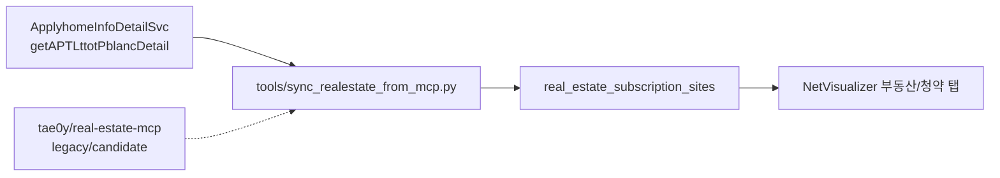

# Real Estate Community MCP Adapter

Date: 2026-06-07
Branch: `codex/realestate-mcp-adapter`

## Goal

Use the approved `한국부동산원_청약홈 분양정보 조회 서비스` endpoint as the default data collector while keeping NetVisualizer stable and Supabase-backed.

The browser app does not call the public API directly. Codex uses a local sync adapter to collect rows, normalizes the result, and upserts into Supabase. The community MCP remains installed as a candidate/legacy collector, but the approved Applyhome endpoint is now the default source.



## Local Installation

The external MCP checkout is intentionally ignored by Git:

```powershell
.\scripts\install-realestate-mcp.ps1
```

If Windows PowerShell blocks local scripts, use:

```powershell
powershell -ExecutionPolicy Bypass -File scripts\install-realestate-mcp.ps1
```

Current local path:

```text
tools/external/real-estate-mcp
```

Codex MCP registration:

```text
real-estate -> tools/external/real-estate-mcp/.venv/Scripts/python.exe src/real_estate/mcp_server/server.py
```

## Secrets

The sync adapter needs a public-data key for live API calls. Store it only in the ignored external checkout:

```powershell
.\scripts\set-realestate-mcp-secrets.ps1 -DataGoKrApiKey "..."
```

For the approved Applyhome API, use the `일반 인증키(Decoding)` as an ODcloud service key:

```powershell
.\scripts\set-realestate-mcp-secrets.ps1 -OdcloudServiceKey "..."
```

Do not commit `.env` or API keys.

## Sync Flow

Dry-run with fixture data:

```powershell
.\scripts\sync-realestate-from-mcp.ps1 -Fixture
```

Execution-policy-safe form:

```powershell
powershell -ExecutionPolicy Bypass -File scripts\sync-realestate-from-mcp.ps1 -Fixture
```

Dry-run with the approved live Applyhome API:

```powershell
.\scripts\sync-realestate-from-mcp.ps1
```

Dry-run for current-year Goyang Changneung notices only:

```powershell
.\scripts\sync-realestate-from-mcp.ps1 -FromDate 2026-01-01
```

Apply to Supabase:

```powershell
$env:SUPABASE_URL="https://<project-ref>.supabase.co"
$env:SUPABASE_SERVICE_ROLE_KEY="..."
.\scripts\sync-realestate-from-mcp.ps1 -Apply
```

## Current Source Coverage

Default source:

- `ApplyhomeInfoDetailSvc/v1/getAPTLttotPblancDetail`: APT notice metadata and schedule dates.

Legacy/candidate MCP coverage:

- `get_apt_subscription_info`: generated file-data style Applyhome APT rows.
- `get_apt_subscription_results`: application/winner/competition/statistics rows.
- Trade/rent tools for apartment, officetel, villa, single-house, and commercial property.

## Boundaries

- NetVisualizer remains independent from the MCP runtime.
- MCP/API failures do not break the browser app because the app reads Supabase rows.
- The adapter currently maps only APT subscription-site rows.
- As of 2026-06-07, the approved live API returns one 2026 Goyang Changneung notice for `고양 창릉 우미 린 그레니티`; S2/S3/S4 are not yet present in the official live response.
- Housing-type and competition table sync should be added after a live ODcloud response is inspected.

## Security Notes

Supabase public tables still have RLS disabled in the current project. This adapter can write through a service role key or an anon key while RLS is disabled, but service role is preferred for controlled sync jobs.
