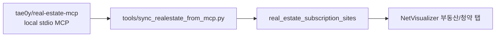

# Real Estate Community MCP Adapter

Date: 2026-06-07
Branch: `codex/realestate-mcp-adapter`

## Goal

Use `tae0y/real-estate-mcp` as a local agent-side data collector while keeping NetVisualizer itself stable and Supabase-backed.

The browser app does not call MCP directly. Codex uses the MCP or its installed package to collect rows, normalizes the result, and upserts into Supabase.



## Local Installation

The external MCP checkout is intentionally ignored by Git:

```powershell
.\scripts\install-realestate-mcp.ps1
```

If Windows PowerShell blocks local scripts, use:

```powershell
powershell -ExecutionPolicy Bypass -File scripts\install-realestate-mcp.ps1
```

Current local path:

```text
tools/external/real-estate-mcp
```

Codex MCP registration:

```text
real-estate -> tools/external/real-estate-mcp/.venv/Scripts/python.exe src/real_estate/mcp_server/server.py
```

## Secrets

The community MCP needs a public-data key for live API calls. Store it only in the ignored external checkout:

```powershell
.\scripts\set-realestate-mcp-secrets.ps1 -DataGoKrApiKey "..."
```

For Applyhome/청약홈 only, a separate ODcloud key can be used:

```powershell
.\scripts\set-realestate-mcp-secrets.ps1 -OdcloudServiceKey "..."
```

Do not commit `.env` or API keys.

## Sync Flow

Dry-run with fixture data:

```powershell
.\scripts\sync-realestate-from-mcp.ps1 -Fixture
```

Execution-policy-safe form:

```powershell
powershell -ExecutionPolicy Bypass -File scripts\sync-realestate-from-mcp.ps1 -Fixture
```

Dry-run with live MCP/API data:

```powershell
.\scripts\sync-realestate-from-mcp.ps1
```

Apply to Supabase:

```powershell
$env:SUPABASE_URL="https://<project-ref>.supabase.co"
$env:SUPABASE_SERVICE_ROLE_KEY="..."
.\scripts\sync-realestate-from-mcp.ps1 -Apply
```

## Current Tool Coverage

The selected MCP exposes:

- `get_apt_subscription_info`: Applyhome APT notice metadata and schedule dates.
- `get_apt_subscription_results`: Applyhome application/winner/competition/statistics rows.
- Trade/rent tools for apartment, officetel, villa, single-house, and commercial property.
- `get_region_code` for MOLIT transaction API region codes.

## Boundaries

- NetVisualizer remains independent from the MCP runtime.
- MCP/API failures do not break the browser app because the app reads Supabase rows.
- The adapter currently maps only subscription-site rows.
- Housing-type and competition table sync should be added after a live ODcloud response is inspected.

## Security Notes

Supabase public tables still have RLS disabled in the current project. This adapter can write through a service role key or an anon key while RLS is disabled, but service role is preferred for controlled sync jobs.
