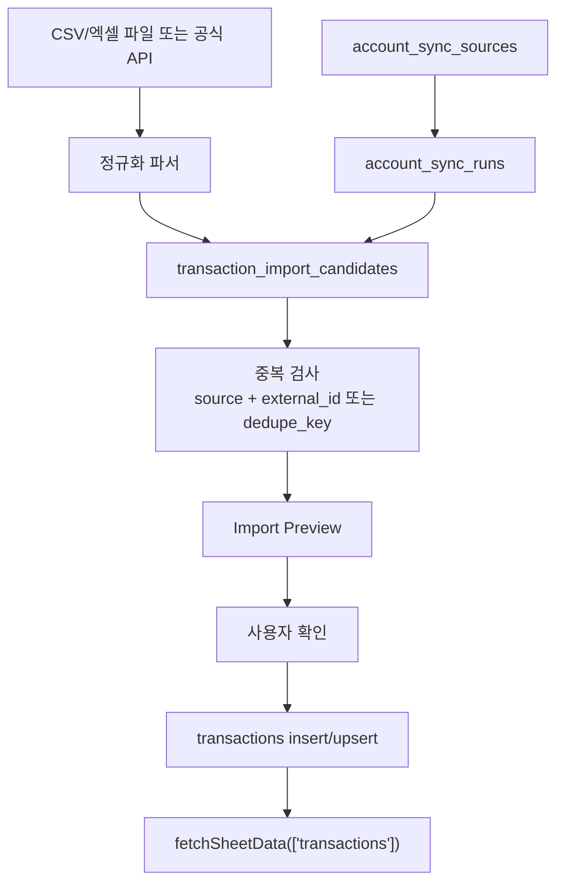

# Realtime DB Sync Feasibility

작성일: 2026-06-05
브랜치: `codex/realtime-db-sync`

## 목표

NetVisualizer의 `transactions`, `portfolios`, `assets` 데이터를 사용자가 매번 Supabase에서 직접 수정하지 않아도 갱신할 수 있게 만든다.

단, 첫 단계의 목표는 "완전 자동 계좌 연동"이 아니다. 금융 인증정보와 개인정보를 안전하게 다루기 위해 다음 순서로 진행한다.

1. CSV/엑셀 import 기반의 반자동 동기화
2. import preview와 중복 방지
3. 서버 측 sync run 기록
4. 공식 API 읽기 전용 연동
5. 정기 동기화

## 현재 결론

| 항목 | 판단 |
| --- | --- |
| 바로 자동 계좌 연동 | 보류 |
| CSV/엑셀 import | 1차 구현 대상 |
| 오픈뱅킹 | 공식 후보, 사용자 동의/OAuth/핀테크이용번호 기반으로 검토 |
| 마이데이터 | 공식 후보이나 사업자/인증/보안 요구가 커서 장기 후보 |
| KIS 계좌/잔고 API | 증권 포트폴리오 후보이나 현재 Quant 단계에서는 시세 조회만 사용 중 |
| 비공식 크롤링/자동 로그인 | 제외 |

## 공식 경로 검토

### 금융결제원 오픈뱅킹/오픈API

금융결제원 개발자 사이트는 오픈뱅킹, 어카운트인포, 금융인증, 카드/보험/대출 관련 조회 API 카테고리를 제공한다.

오픈뱅킹 문서는 OAuth 2.0 기반 사용자 동의 흐름을 설명하며, 계좌등록은 사용자가 오픈뱅킹 계좌등록 페이지에서 수행하고 클라이언트는 실제 계좌번호 대신 핀테크이용번호를 받는 구조다.

참고:

- https://developers.kftc.or.kr/
- https://developers.kftc.or.kr/dev/openapi/open-banking

### 금융보안원 마이데이터 통합인증

마이데이터 통합인증 중계시스템은 통합인증 절차와 API 사용 방법을 제공한다. 다만 개인 프로젝트에서 바로 붙이기에는 기관 등록, 인증, 보안, 운영 부담이 크다.

참고:

- https://www.mydatacert.org/

### 한국투자증권 Open API

KIS Open API는 현재 Quant 시세 조회 provider로 이미 일부 연결되어 있다. 계좌잔고/체결/주문 API로 확장 가능하지만, 앱키가 계좌 접근권한과 연결되므로 별도 보안 설계 전까지는 시세 조회 외 API를 호출하지 않는다.

참고:

- https://github.com/koreainvestment/open-trading-api

## 1차 구현 범위

### 포함

- `account_sync_sources`: 데이터 출처와 동기화 상태 메타데이터
- `account_sync_runs`: import/sync 실행 이력
- `transaction_import_candidates`: 거래내역 import 후보 staging
- 중복 방지 키 설계
- import preview UI 설계
- 수동 confirm 후 `transactions` insert/upsert

### 제외

- 은행/카드/증권 로그인 자동화
- 공동인증서, 비밀번호, OTP, 보안카드 저장
- 브라우저 localStorage 토큰 저장
- 계좌번호 원문 저장
- 이체, 주문, 체결 API
- 자동 스케줄러

## 데이터 흐름



## 중복 방지 기준

우선순위:

1. provider가 주는 거래 고유 ID
2. provider account key + posted date + amount + normalized memo
3. date + amount + memo + method

권장 dedupe key:

```text
sha256(provider + provider_account_key + date + amount + currency + normalized_memo)
```

계좌번호 원문은 dedupe key 재료로 직접 저장하지 않는다. 공식 API가 제공하는 핀테크이용번호 또는 내부 opaque key만 사용한다.

## 보안 원칙

- 브라우저에는 Supabase anon key 외 금융 secret을 두지 않는다.
- 금융 API secret은 Supabase Edge Function secret 또는 별도 backend secret store에만 둔다.
- access token/refresh token을 일반 테이블에 저장하지 않는다.
- 저장이 불가피한 연결 식별자는 원문 계좌번호가 아니라 provider opaque key 또는 hash만 사용한다.
- RLS를 켜기 전에는 외부 공개 앱에서 자동 동기화 기능을 활성화하지 않는다.

## RLS 선결 조건

현재 Supabase advisory는 public table RLS 비활성화를 critical로 보고한다. 자동 동기화는 금융 데이터 수집 범위가 넓어지므로 RLS/Auth 설계 전까지는 다음 이상으로 확장하지 않는다.

- 로컬/개인 사용
- 수동 import
- 읽기 전용 provider dry-run
- service role을 사용하는 Edge Function 내부 처리

## 구현 단계

| 단계 | 목표 | 산출물 |
| --- | --- | --- |
| 1 | 스키마 초안 | `realtime-db-sync-schema.sql` |
| 2 | import preview 모델 | 후보 row, status, dedupe key |
| 3 | CSV import UI | 파일 선택, preview, confirm |
| 4 | Edge Function scaffold | provider별 parser와 dry-run |
| 5 | 공식 API PoC | 오픈뱅킹 또는 KIS 중 하나만 읽기 전용 |
| 6 | 스케줄/모니터링 | 수동 안정화 후 |

## 이번 브랜치의 완료 조건

- main과 분리된 브랜치에서 작업한다.
- 원격 금융 API 호출 없이도 import staging 구조를 설명할 수 있다.
- 실제 DB 적용 전 SQL 초안과 rollback 방향을 문서화한다.
- RLS 비활성 상태에서는 자동 API 연동을 활성화하지 않는다.
