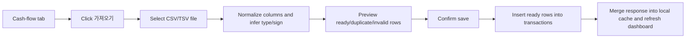

# Realtime DB Sync Import UI Report

Date: 2026-06-05
Branch: `codex/realtime-db-sync`

## Summary

This branch implements the first safe, practical step toward realtime DB sync: CSV/TSV transaction import with preview and duplicate filtering.

The feature does not call bank APIs, does not store financial credentials, and does not apply new remote Supabase schema. It writes confirmed rows to the existing `transactions` table only.

## User Flow



## Implemented Behavior

- Added `가져오기` buttons to the cash-flow main chart and transaction detail table.
- Added a transaction import modal with file input, optional default payment method, preview summary, and preview table.
- Supports comma and tab separated files.
- Recognizes common Korean and English column names for date, time, transaction type, category, subcategory, memo, amount, withdrawal, deposit, payment amount, currency, and method.
- Infers transaction type and amount sign for common bank/card rows.
- Filters rows that are missing a valid date or non-zero amount.
- Filters duplicate rows against the currently loaded app data.
- Filters duplicate rows inside the same import file.
- Inserts only rows marked `저장 가능`.
- Records recent import run summaries locally without storing raw transaction rows.

## Duplicate Key

The browser import path uses this key:

```text
date | time | type | amount | normalized memo | normalized method
```

This is intentionally simple because the current implementation avoids storing raw account numbers or provider identifiers.

## Limitations

- Import audit history is currently local-only and not shared across browsers/devices.
- The drafted staging tables in `docs/03-analysis/realtime-db-sync-schema.sql` have not been applied.
- CSV formats vary by institution, so the first real file should be tested with a small export.
- RLS is still disabled on current public Supabase tables, so automatic provider sync remains blocked until Auth/RLS policy design is complete.

## Recommended Next Step

Test one small real bank/card CSV export, then decide whether to keep this lightweight import-only path or apply the staging/audit schema before expanding to official provider sync.
