# NetVisualizer 제로베이스 애플리케이션 검토

- 검토일: 2026-07-15
- 범위: 현재 로컬 `main` 작업 트리, 실행 중인 로컬 앱, Supabase 마이그레이션
- 관점: 코드 구조, 성능, 보안, AI 협업 비용, UI/UX, Finance/Life 기능, 제품 방향
- 방법: 정적 코드 계측, 핵심 화면 12개 데스크톱/모바일 캡처, 브라우저 DOM 확인
- 제외: 실제 사용자 인터뷰, 키보드·스크린리더 실기 테스트, 운영 로그/트래픽 분석

## 1. 결론

NetVisualizer는 이미 단순 가계부를 넘어 자산, 현금흐름, 포트폴리오, 청약, 할 일, 건강을 한곳에 모은 개인 운영 도구의 형태를 갖췄다. 특히 Portfolio와 Finance Home은 실제 데이터로 현황을 빠르게 훑는 데 강점이 있다.

그러나 현재는 **새 기능보다 신뢰 기반을 먼저 복구해야 하는 시점**이다.

1. 공개 서버 모드가 익명 사용자에게 개인 데이터 CRUD를 허용한다.
2. 브라우저 JavaScript와 TypeScript가 서로 다른 런타임으로 중복되어 있다.
3. 전역 상태, 2차원 배열, 문자열 HTML 렌더링이 기능 간 결합을 키운다.
4. 화면마다 자산 숫자의 기준과 갱신 시점이 달라 사용자가 무엇을 믿어야 하는지 알기 어렵다.
5. Finance는 조회 화면이 많지만 다음 행동을 결정해 주는 기능이 약하고, Life는 아직 홈 화면이 상태를 요약하지 못한다.

권장 방향은 **Finance-first Personal OS**다.

> 내 돈, 프로젝트, 건강, 할 일을 연결해 오늘 무엇을 확인하고 실행해야 하는지 알려주는 개인 운영 대시보드

Finance를 신뢰 가능한 원장과 의사결정 중심으로 깊게 만들고, Life는 Finance 목표를 실행하는 프로젝트·할 일·루틴 계층으로 연결한다. 재무 네트워크 그래프는 메인 내비게이션이 아니라 관계를 설명하고 탐색하는 보조 화면으로 두는 편이 적합하다.

## 2. 현재 건강도

| 영역 | 점수 | 판단 |
| --- | ---: | --- |
| 개인정보 보호 | 1/5 | 익명 CRUD 정책 때문에 외부 공개 불가 |
| 코드 유지보수성 | 2/5 | 기능 파일 분리는 시작됐지만 전역 상태와 중복 런타임이 남음 |
| AI 작업 토큰 효율 | 2/5 | 대형 파일, 중복 구현, 문서 드리프트로 매번 읽을 범위가 큼 |
| Finance UX | 3.5/5 | 현황 조회는 강하지만 지표 정의와 행동 제안이 부족 |
| Life UX | 2/5 | 개별 도구는 작동하지만 홈·연결·리마인드가 약함 |
| 제품 초점 | 2.5/5 | 소재는 좋지만 Finance, Life, Graph의 주종 관계가 불명확 |

## 3. 심각도별 핵심 발견

### P0. 익명 사용자가 개인 데이터를 읽고 수정할 수 있다

- `js/features/appCore.js:88-89`에서 `AUTH_REQUIRED_FOR_REMOTE = false`, `CLOUD_AUTH_PAUSED = true`로 설정되어 있다.
- `supabase/migrations/20260713090000_enable_public_server_mode.sql:4-12`는 단일 소유자 UUID를 함수로 공개한다.
- 같은 마이그레이션의 `transactions`, `assets`, `portfolios`, `cards`, `insurances`, 건강, 할 일, Quant override 정책은 `anon`에 SELECT/INSERT/UPDATE/DELETE를 허용한다. 예: `:39-58`.
- 브라우저에는 공개 가능한 publishable key가 들어 있지만, 현재 RLS와 결합하면 앱 주소와 키를 아는 익명 요청이 개인 행에 접근할 수 있다.

**영향:** 재무, 건강, 할 일 데이터의 기밀성·무결성을 보장할 수 없다. 이 상태에서는 외부 배포, 실데이터 확대, 자동 금융 연동을 중단해야 한다.

**즉시 조치:**

1. public-server 정책을 폐기하는 역마이그레이션을 만든다.
2. 모든 개인 테이블을 `auth.uid() = user_id` owner-only RLS로 통일한다.
3. 앱에서 인증을 다시 필수로 만들고 세션 만료·로그아웃·미인증 상태를 테스트한다.
4. 익명 접근 가능 기간과 공유 범위를 확인하고 필요하면 데이터/키를 교체한다.
5. 이 조치가 끝날 때까지 신규 개인정보와 금융 API 비밀값을 넣지 않는다.

### P1. TypeScript가 실제 앱 런타임이 아니며 같은 CFO 로직이 두 벌이다

- 실제 브라우저는 `index.html:31-42`의 classic JavaScript를 실행한다.
- `src/features/personal-cfo/`의 TypeScript/TSX는 `tsc --noEmit` 검사만 받고 앱에서 import되지 않는다.
- `calculateTotalAssets`, `calculateNetWorth`, `calculateSavingsRate`, `buildFinanceGraphFromSnapshot` 등이 `src/features/personal-cfo/*`와 `js/features/personalCfo.js:531-810`에 중복되어 있다.

**영향:** 한쪽만 수정해도 타입 검사는 통과하지만 실제 화면은 바뀌지 않거나, 좌표·계산 결과가 서로 어긋날 수 있다. AI도 매번 두 구현을 읽고 동기화해야 한다.

**권장:** Vite + React + TypeScript를 실제 런타임으로 채택하고, 기능별로 한 화면씩 기존 JS를 교체한다. 전면 재작성은 하지 않는다.

### P1. 전역 상태와 레거시 배열 계약이 변경 범위를 키운다

- `js/features/appCore.js:46-90`에 화면, 차트, 데이터, 인증 상태가 함께 있는 가변 전역 변수가 집중되어 있다.
- 파일 스스로 `legacy static app` 전역 상태 공유를 명시한다(`appCore.js:2`).
- Supabase 객체를 레거시 2차원 배열로 바꾼 뒤 `parseTxData`, `parseAssetData`, `parsePortfolioData`가 `row[0]...row[16]`으로 다시 해석한다(`appCore.js:1126-1245`).
- `index.html`과 기능 JS에 인라인 이벤트 속성이 67개 남아 있다.

**영향:** DB 컬럼 하나를 바꿔도 쿼리, 배열 순서, 파서, 전역 상태, 여러 렌더러를 함께 확인해야 한다. 위치 기반 배열은 타입 검사의 도움을 받지 못한다.

### P1. 행동 회귀를 잡는 테스트가 없다

- `package.json`의 검사는 manifest, JS 문법, TS 타입, Supabase select 계약, 정적 자산만 확인한다.
- 단위 테스트와 브라우저 E2E 테스트 파일은 없다.

**영향:** 정적 검사가 통과해도 로그인, 새로고침, 저장, 삭제, 모바일 내비게이션, 캐시 복구가 깨질 수 있다.

### P1. 핵심 재무 숫자의 정의와 기준 시점이 화면마다 다르다

현재 캡처에서 Finance Home 총자산은 `236,105,401원`, Portfolio 순자산은 `234,601,305원`, Personal CFO 순자산은 약 `1.92억`으로 표시된다. 서로 다른 모델을 쓰는 것 자체는 가능하지만, 화면에 데이터 원천·기준일·포함/제외 항목이 설명되지 않는다.

**영향:** 재무 앱에서 가장 중요한 신뢰가 약해진다. 계산 정확도보다 먼저 사용자가 어떤 숫자를 공식 값으로 봐야 하는지 결정해야 한다.

### P2. 로컬 캐시에 개인정보가 평문으로 오래 남는다

- Finance 전체 캐시는 `appCore.js:29`, `:924-925`, `:1269-1275`에서 `localStorage`에 저장된다.
- Todo, Health, Personal CFO도 각각 별도 `localStorage`를 사용한다.

개인 기기용 빠른 캐시는 유용하지만 로그아웃 후 삭제 정책, 민감도별 캐시 범위, 공용 PC 안내가 없다.

### P2. 대형 파일과 문자열 렌더링이 성능·안전·토큰 비용을 동시에 높인다

- 기능 JS는 약 8,200줄, 445KB다.
- `checklist.js`, `appCore.js`, `personalCfo.js`, `financeViews.js`가 각각 약 1,000줄 이상이다.
- `innerHTML =` 사용이 73곳이고, `escapeHtml`도 여러 파일에 중복되어 있다.
- Tailwind runtime, Supabase, Chart.js, SheetJS, FontAwesome, Leaflet을 CDN에서 초기 로드한다(`index.html:18-29`).

모든 `innerHTML`이 취약한 것은 아니지만, 원격 문자열이 들어가는 경로는 지속적으로 XSS 검토가 필요하다. SheetJS·Leaflet 같은 무거운 라이브러리는 해당 화면 진입 시 지연 로드하는 편이 낫다.

## 4. 코드 꼬임 개선안

### 목표 구조

```text
src/
  app/
    App.tsx
    routes.tsx
    auth/
  shared/
    api/supabase.ts
    storage/cache.ts
    format/
    ui/
  features/
    finance/
      dashboard/
      cashflow/
      portfolio/
      personal-cfo/
      real-estate/
    life/
      today/
      projects/
      todos/
      health/
  test/
supabase/
  migrations/
  tests/
```

각 기능 내부는 변경 이유에 따라 나눈다.

```text
personal-cfo/
  domain/types.ts
  domain/calculations.ts
  data/personalCfoRepository.ts
  ui/CfoKpiGrid.tsx
  ui/FinanceNetwork.tsx
  pages/PersonalCfoPage.tsx
  personalCfo.test.ts
```

한 함수당 한 파일처럼 과도하게 쪼개지 않는다. 순수 계산, 외부 I/O, UI 렌더링, 페이지 조합이 각각 독립적으로 바뀔 때만 분리한다.

### 목표 데이터 흐름

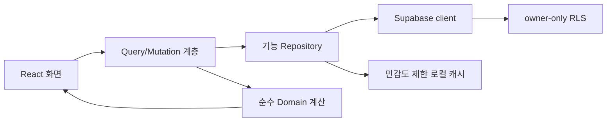

### 마이그레이션 순서

1. Auth/RLS를 먼저 고친다.
2. Vite + React + TypeScript 앱 셸을 추가하고 기존 화면을 compatibility route로 유지한다.
3. Supabase 생성 타입과 객체 기반 repository를 만든다.
4. Personal CFO처럼 이미 TS 모델이 있는 기능부터 실제 런타임으로 옮긴다.
5. Todo, Health, Portfolio, Cash Flow 순으로 옮긴다.
6. 화면이 옮겨질 때마다 대응하는 `js/features/*.js` 구현을 삭제한다.
7. 마지막에 `index.html`의 대형 정적 마크업과 classic script를 제거한다.

## 5. 바이브코딩 토큰 절약 설계

토큰을 줄이는 핵심은 파일 개수 자체가 아니라 **한 작업에 읽어야 하는 경계**를 줄이는 것이다.

1. 기능당 `README.md`를 30~60줄로 둔다: 책임, 데이터 원천, 주요 타입, 테스트 명령, 건드리지 말아야 할 경계를 기록한다.
2. 한 개의 실제 런타임만 둔다: TS와 JS를 동시에 수정하는 규칙을 없앤다.
3. Supabase 타입을 생성한다: 배열 인덱스와 컬럼 순서를 설명하는 프롬프트를 없앤다.
4. 순수 domain 함수에 단위 테스트를 둔다: AI가 큰 UI 파일을 읽지 않고 계산을 변경할 수 있다.
5. 페이지 파일은 조합만, 컴포넌트는 표현만, repository는 I/O만 담당한다.
6. 공통 formatter, sanitizer, toast, dialog를 `shared` 한곳에 둔다.
7. 작업별 체크 명령을 짧게 만든다: `check:finance`, `check:life`, `test:e2e:smoke`.
8. `docs/architecture/current.md` 한 문서를 현재 기준으로 유지하고 과거 보고서는 archive로 표시한다.

권장 파일 크기는 대체로 150~350줄이다. 다만 억지 분리보다 “이 변경을 위해 다른 관심사를 읽어야 하는가”를 기준으로 판단한다.

## 6. UI/UX 감사

### 전체 강점

- 좌측 목표 내비게이션과 상단 Finance/Life 전환은 큰 영역 구분을 이해하기 쉽다.
- Portfolio는 요약, 유동성, 그룹별 상세가 한 흐름에 있어 가장 완성도가 높다.
- Todo는 목록-상세 구조, 카테고리 색, 단계 편집으로 단순 체크리스트보다 발전할 기반이 있다.
- 데스크톱과 모바일 모두 핵심 카드가 크게 무너지지 않고 재배치된다.

### 구조적 문제

1. 앱 셸 제목과 본문 제목이 반복되어 세로 공간을 낭비한다.
2. Finance Cockpit, Portfolio, Cash Flow, Health, Board, Cloud saved처럼 한글과 영어가 혼용된다.
3. Finance Home은 현황이 많지만 “오늘 확인할 예외”와 “권장 행동”이 없다.
4. Personal CFO 그래프는 데스크톱에서도 연결량이 많고, 모바일에서는 1,120px 이상 캔버스의 일부만 보여 핵심 정보를 읽기 어렵다.
5. Life Home은 Health와 Todo 진입 카드만 있어 홈이 아니라 메뉴 화면에 가깝다.
6. Health는 영어 중심이고, 실제 최근 체중과 무관한 기본 입력값처럼 보이는 값이 신뢰를 떨어뜨릴 수 있다.
7. Todo의 긴 상세 메모가 카드 미리보기에 섞이고, 우선순위·반복·알림·프로젝트 연결이 없다.
8. 모바일 하단 탭이 `재무맵 / Cash / Portfolio / Assets / Estate`처럼 언어와 정보 수준이 섞여 있다.

### 화면별 상태

| 단계 | 화면 | 건강도 | 핵심 판단 |
| ---: | --- | --- | --- |
| 1 | Finance Home 데스크톱 | 보통 | 현황은 좋지만 데이터 기준과 다음 행동이 약함 |
| 2 | Personal CFO 데스크톱 | 보통 | KPI는 유용하나 그래프가 과밀하고 조작·설명 계층이 부족 |
| 3 | Portfolio 데스크톱 | 좋음 | 가장 읽기 쉽지만 `기타` 비중이 커 차트의 의사결정 가치가 낮음 |
| 4 | Cash Flow 데스크톱 | 보통 이상 | 추이는 명확하나 실제 잉여현금·예산차이가 전면에 없음 |
| 5 | Life Home 데스크톱 | 미흡 | 빈 공간이 많고 상태 요약·오늘 할 일·건강 추이가 없음 |
| 6 | Todo 목록 데스크톱 | 보통 이상 | 목록 구조는 좋으나 빈 상세 패널과 긴 메모 노출이 거침 |
| 7 | Todo 상세 데스크톱 | 보통 | 메모·스텝은 좋지만 프로젝트·반복·알림 모델이 없음 |
| 8 | Health 데스크톱 | 보통 | 입력 흐름은 단순하나 언어, 기본값, 삭제 배치가 불안 |
| 9 | Finance Home 모바일 | 보통 이상 | 카드 재배치는 안정적이나 제목 반복과 탭 언어 혼용이 남음 |
| 10 | Personal CFO 모바일 | 미흡 | 그래프가 잘려 모바일 핵심 작업을 수행하기 어려움 |
| 11 | Life Home 모바일 | 미흡 | 기능 카드 두 개 외 사용자 상태가 없음 |
| 12 | Todo 모바일 | 보통 이상 | 스캔은 쉽지만 작은 글씨·아이콘 버튼·긴 내용 잘림이 있음 |

### 접근성 위험

- DOM에서 홈, 동기화, 설정, 삭제, 추가 버튼 일부의 접근 가능한 이름이 아이콘 문자로만 잡힌다.
- 10~11px 수준의 작은 보조 글자와 연한 회색 텍스트가 많다.
- 드래그 핸들 기반 Todo 순서 변경은 키보드 대체 동작이 확인되지 않는다.
- 그래프는 이미지 대체 이름은 있으나 노드 관계를 표·목록으로 동일하게 탐색할 수 없다.
- 색으로 Career/Finance/Life와 위험 수준을 구분하므로 텍스트·아이콘 보조가 필요하다.

스크린샷과 DOM만으로 실제 키보드 포커스 순서, 스크린리더 발화, 정확한 대비율, 200% 확대, 동작 감소 설정, 오류 복구는 검증하지 못했다.

## 7. Finance 기능 제안

### 지금 필요한 것

| 우선순위 | 기능 | 이유 |
| --- | --- | --- |
| P0 | 지표 사전과 기준일 | 총자산·순자산·현금흐름의 원천과 포함 범위를 통일 |
| P0 | 실제값/가정값 분리 | 현재 부채와 미래 주거 대출 시나리오가 섞이지 않게 함 |
| P1 | 월간 CFO 마감 | 누락 거래, 계좌 잔액, 월 잉여현금, 목표 배분을 한 번에 점검 |
| P1 | Decision Inbox | 만기 임박, 고정비 급증, 목표 이탈, 현금 부족 등 행동 항목만 모음 |
| P1 | 자금 바구니 목표/실제 | 운영·방어·주거·성장·인적자본 배분을 월별 비교 |
| P1 | 90일 현금 전망 | 예정 지출, 대출 상환, 보험, 카드 결제를 반영한 잔액 전망 |
| P1 | 프로젝트 자금 연결 | 청약·온라인 석사의 필요 자금, 확보액, 월 소진, 다음 의사결정 연결 |
| P2 | 리밸런싱 행동안 | 자산 비중 표시를 넘어 매수/매도/보류 이유와 목표 편차 제공 |
| P2 | 이상 탐지 | 평소보다 큰 지출, 중복 구독, 비정상 잔액 변화를 알려 줌 |
| P3 | 세금·보험 문서 보관 | 핵심 사용 흐름이 안정된 뒤 확장 |

### 줄이거나 보류할 것

- 결정에 쓰이지 않는 그래프 노드와 KPI 추가
- 데이터 신뢰가 확보되기 전 AI 재무 조언
- 금융기관 자동 연동과 비밀키 보관
- 범용 주식 분석 플랫폼 수준의 Quant 확장

## 8. Life 기능 제안

Life는 별도 종합 생활 앱이 아니라 Finance 목표와 개인 프로젝트의 실행 계층으로 좁히는 것이 좋다.

| 우선순위 | 기능 | 화면에서의 역할 |
| --- | --- | --- |
| P1 | 오늘 | 오늘 할 일, 기한 초과, 체중 기록 여부, 다가오는 일정 3~5개 |
| P1 | 프로젝트 | 청약·온라인 석사를 목표, 다음 행동, 예산, 리스크와 함께 관리 |
| P1 | 반복/리마인드 | 주간 점검, 월간 마감, 납부, 운동·건강 기록을 자동 생성 |
| P1 | Todo-Project 연결 | 할 일을 Career/Finance/Life보다 구체적인 프로젝트에 귀속 |
| P2 | 간단한 건강 루틴 | 체중 외 수면·운동·약 복용은 숫자 수집보다 체크 중심으로 최소화 |
| P2 | 메모에서 행동 추출 | 긴 메모를 프로젝트, 다음 할 일, 참고자료로 나눔 |
| P3 | 캘린더 연동 | 반복/기한 모델이 안정된 뒤 일정 충돌과 리마인드 연결 |

주간 시간표, 여행 계획, 식단, 광범위한 습관 트래커는 당장 다시 넣지 않는 편이 좋다. 범용 Life 앱 경쟁으로 빠지면 Finance의 차별점과 개발 집중력이 함께 약해진다.

## 9. 제품 방향 대안

### A. Personal CFO 전용

- 장점: 가장 선명하고 데이터 모델을 깊게 만들기 쉽다.
- 단점: 프로젝트와 행동 관리가 외부 도구로 분리된다.
- 적합 조건: 재무 의사결정과 자산 관리만 확실히 완성하려는 경우.

### B. Finance-first Personal OS — 권장

- 장점: Finance를 차별화 축으로 유지하면서 Todo/Health를 실행 맥락으로 연결한다.
- 단점: Finance와 Life의 경계를 엄격히 지키지 않으면 다시 커질 수 있다.
- 핵심 구조: `돈의 상태 -> 목표/프로젝트 -> 오늘의 행동 -> 월간 회고`.

### C. 범용 Life OS

- 장점: 사용 빈도를 높일 소재가 많다.
- 단점: Todo, 캘린더, 헬스 앱과 직접 경쟁하며 현재 강점인 재무 맥락이 희석된다.
- 현재 권장하지 않는다.

## 10. 자유 기획 제안

### 10.1 Decision Inbox

앱 첫 화면에 모든 차트를 넣지 말고, 사용자가 결정해야 할 항목만 최대 5개 보여 준다.

- 이번 달 고정비율이 목표보다 4.2% 높음
- 청약 자금 목표가 계획보다 3개월 늦음
- 14일 내 카드 결제 후 운영자금이 기준 아래로 내려감
- 온라인 석사 조사 다음 할 일이 9일째 멈춤

각 항목은 `확인`, `할 일 만들기`, `나중에`, `가정 수정` 중 하나로 끝난다.

### 10.2 월간 CFO 마감

매월 한 번 5분 안에 끝내는 흐름을 만든다.

1. 계좌 잔액과 거래 누락 확인
2. 순자산 변화 원인 확인
3. 바구니별 목표 대비 확인
4. 프로젝트 자금·리스크 확인
5. 다음 달 행동 1~3개를 Todo로 확정

### 10.3 Fact / Assumption 표시

모든 중요한 숫자에 다음 배지를 붙인다.

- `실제 · Supabase · 2026-07-15`
- `수동 입력 · 2026-07-10`
- `가정 · 금리 4.2%`
- `Mock`

이것만으로도 서로 다른 화면의 숫자 차이를 오류가 아니라 설명 가능한 모델로 바꿀 수 있다.

### 10.4 그래프의 역할 재정의

그래프는 기본 화면이 아니라 다음 질문에 답할 때 연다.

- 내 월급이 어떤 자금과 프로젝트로 흘러가는가?
- 특정 리스크가 어떤 자산과 목표에 영향을 주는가?
- 이 프로젝트를 늘리면 어떤 목표가 느려지는가?

모바일에서는 그래프 대신 `자금 흐름`, `프로젝트`, `리스크` 세 개의 정렬 가능한 목록을 기본으로 제공한다.

## 11. 실행 로드맵

### 0단계: 보안 동결 및 복구 — 1~2일

- public-server 정책 제거
- 로그인 필수와 owner-only RLS 복원
- 로그아웃 캐시 정책 결정
- 익명 CRUD 자동 테스트

완료 기준: 인증 없는 SELECT/INSERT/UPDATE/DELETE가 모두 거부된다.

### 1단계: 런타임 기반 — 1~2주

- Vite + React + TypeScript 셸
- Supabase 타입 생성과 repository
- Auth guard, query cache, 오류/로딩 공통 상태
- Vitest + Playwright smoke test

완료 기준: TS 코드가 실제 화면을 렌더링하고 CFO 중복 JS가 제거된다.

### 2단계: Finance 신뢰 회복 — 1~2주

- 지표 사전, 기준일, Fact/Assumption
- 모든 화면의 순자산 단일 정의
- 월간 CFO 마감과 Decision Inbox v1
- 실제/시나리오 부채 분리

완료 기준: 같은 기준일·범위의 핵심 숫자가 모든 화면에서 일치한다.

### 3단계: Life 실행 계층 — 약 1주

- Today 화면
- Todo 반복·알림·프로젝트 연결
- 청약/온라인 석사 프로젝트 다음 행동
- Health 한글화와 안전한 입력 기본값

완료 기준: Finance에서 생성한 행동이 Life Today에서 실행되고 다시 프로젝트 상태에 반영된다.

### 4단계: 선택적 실험

- 90일 현금 전망
- 리밸런싱 행동안
- 캘린더 연동
- 그래프 필터/비교 시나리오

## 12. 검증 체계

### 자동 테스트

- Vitest: 모든 Finance 계산, 분류, adapter, project/risk score
- Playwright: 로그인, 새로고침, 거래 저장, 포트폴리오 수정, Todo 추가/편집, Health 저장
- Supabase: owner A가 owner B 행에 접근하지 못하는 RLS 테스트
- 시각 회귀: 390px와 1440px의 핵심 6개 화면

### 성과 지표

| 지표 | 목표 |
| --- | --- |
| 미인증 개인 데이터 접근 | 0건 |
| 핵심 지표 화면 간 불일치 | 0건 |
| 주요 계산 단위 테스트 | 90% 이상 |
| 핵심 사용자 흐름 E2E | 100% 통과 |
| 첫 화면에서 오늘 행동 발견 | 10초 이내 |
| 월간 CFO 마감 | 5분 이내 |
| 초기 필수 JS | 200KB 이하를 1차 목표로 계측 |

## 13. 화면 증거

### 1. Finance Home 데스크톱

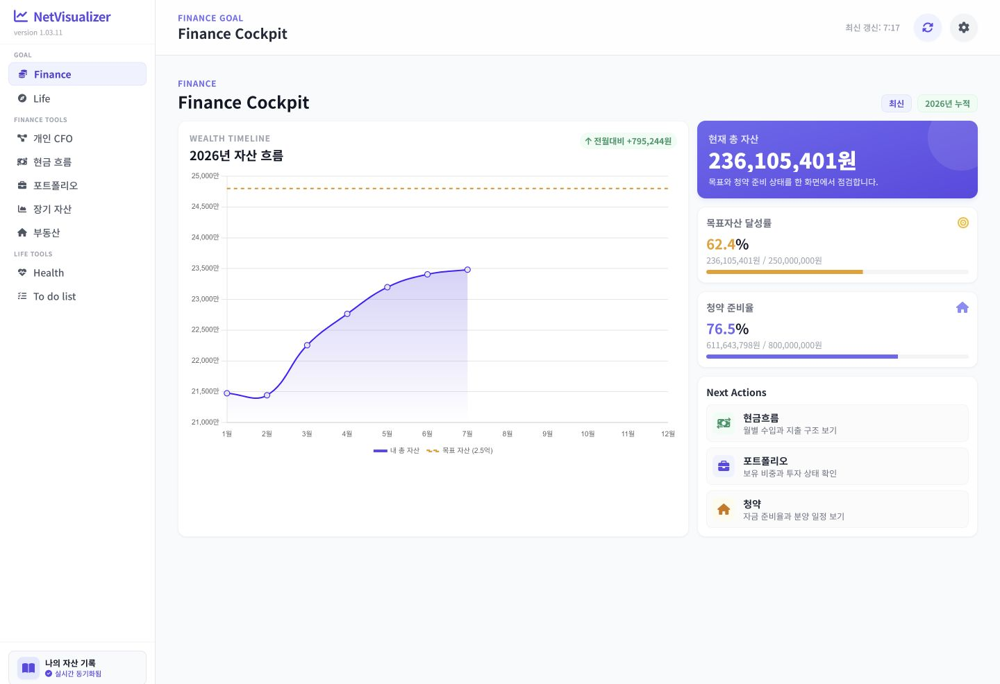

### 2. Personal CFO 데스크톱

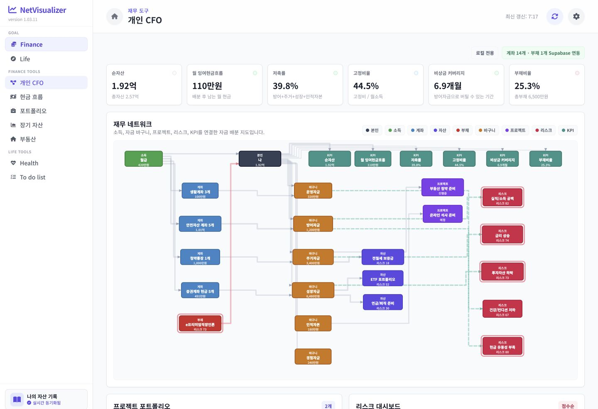

### 3. Portfolio 데스크톱

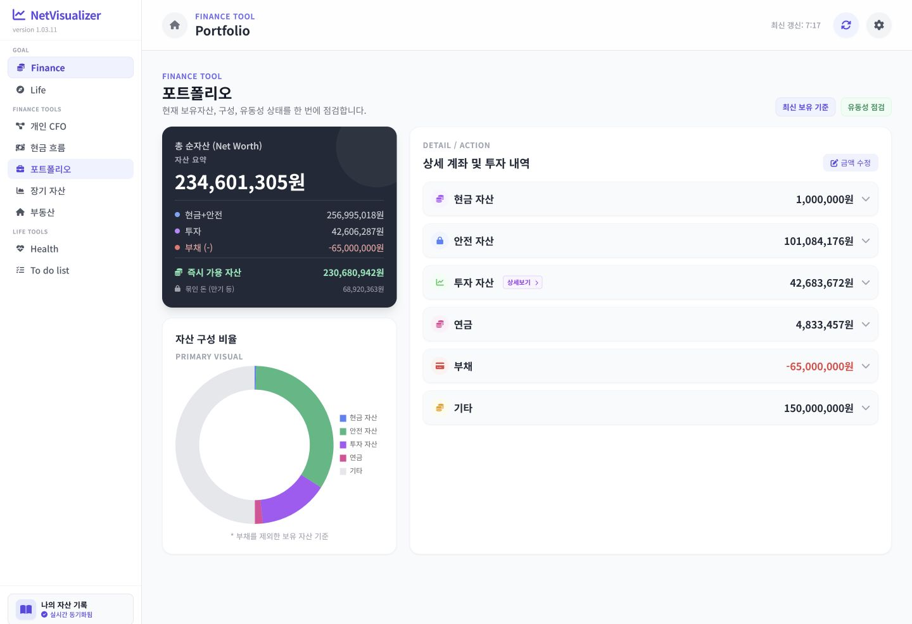

### 4. Cash Flow 데스크톱

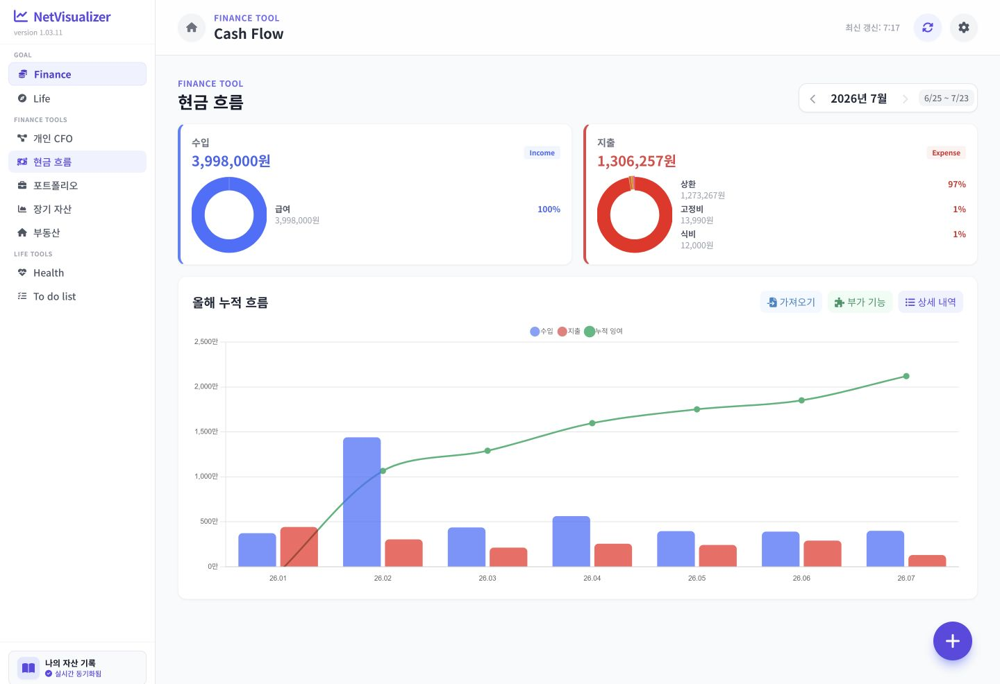

### 5. Life Home 데스크톱

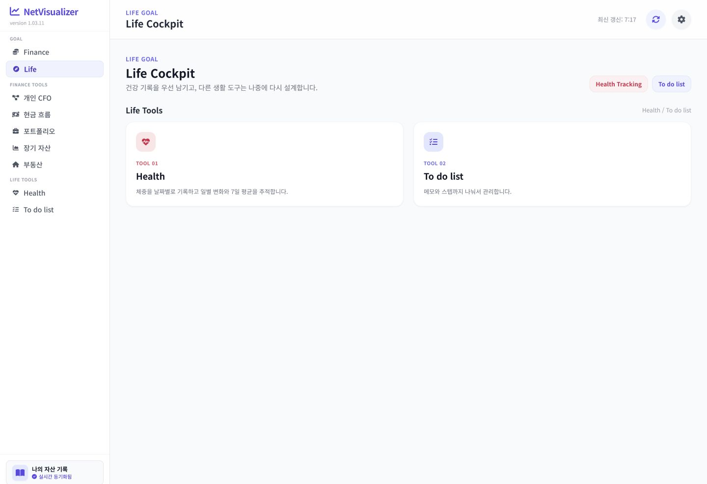

### 6. Todo 목록 데스크톱

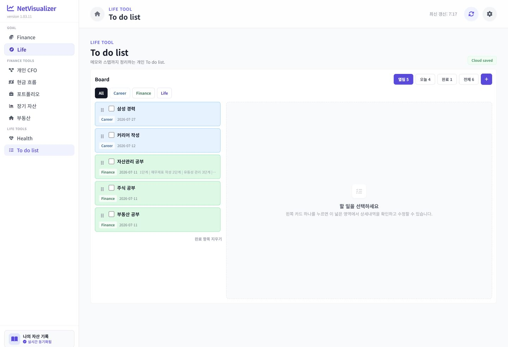

### 7. Todo 상세 데스크톱

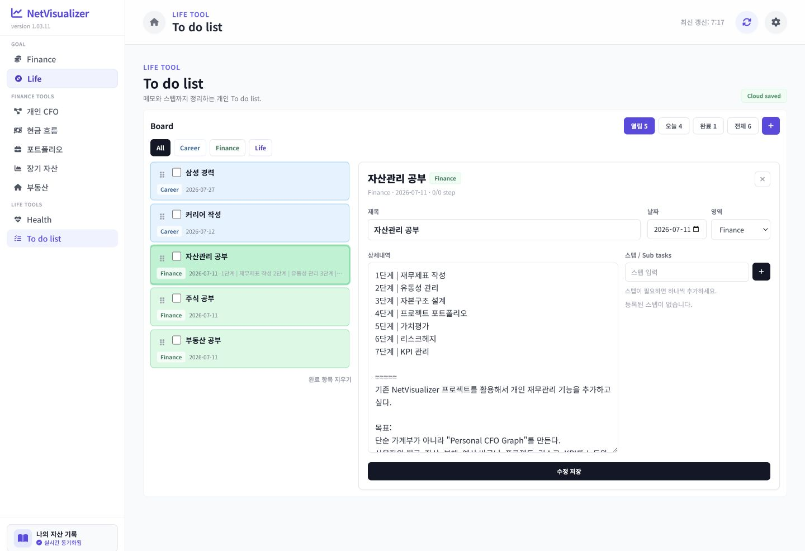

### 8. Health 데스크톱

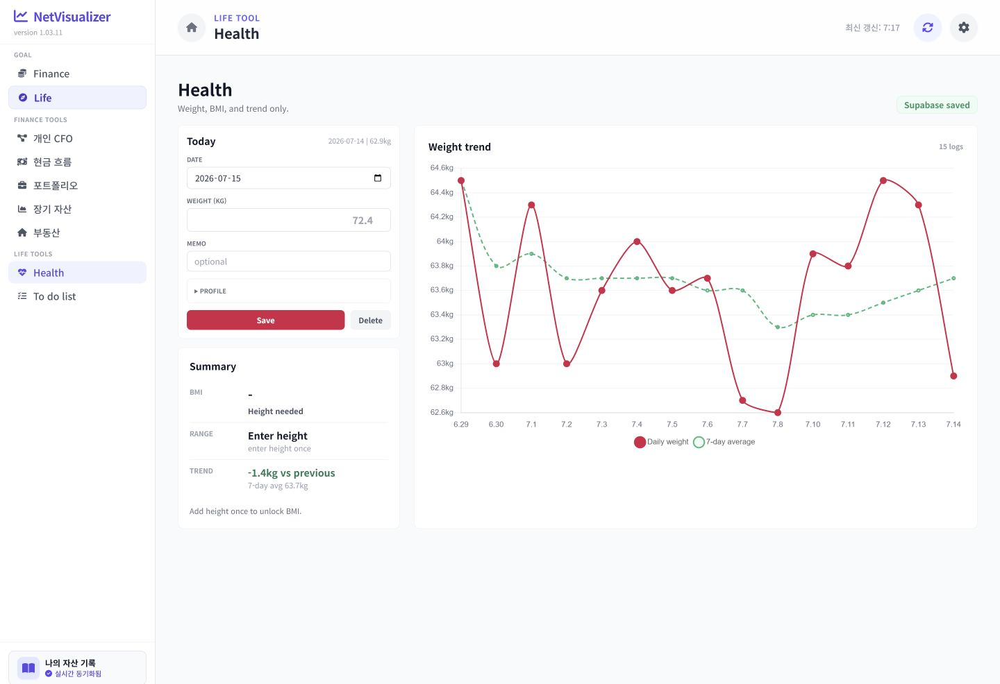

### 9. Finance Home 모바일

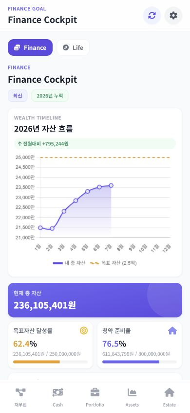

### 10. Personal CFO 모바일

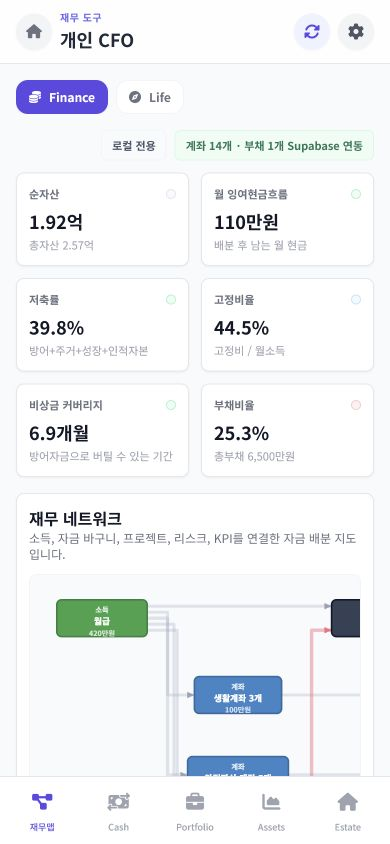

### 11. Life Home 모바일

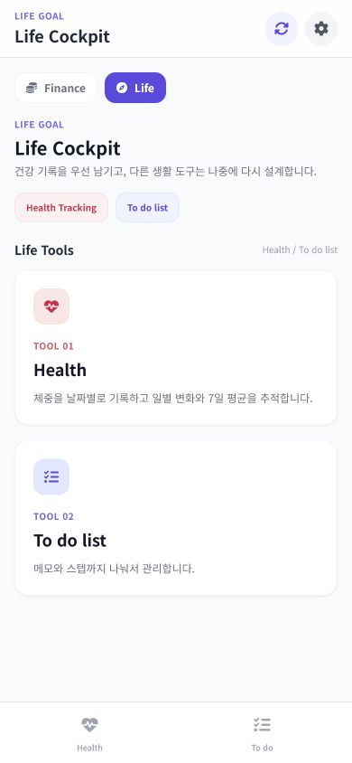

### 12. Todo 모바일

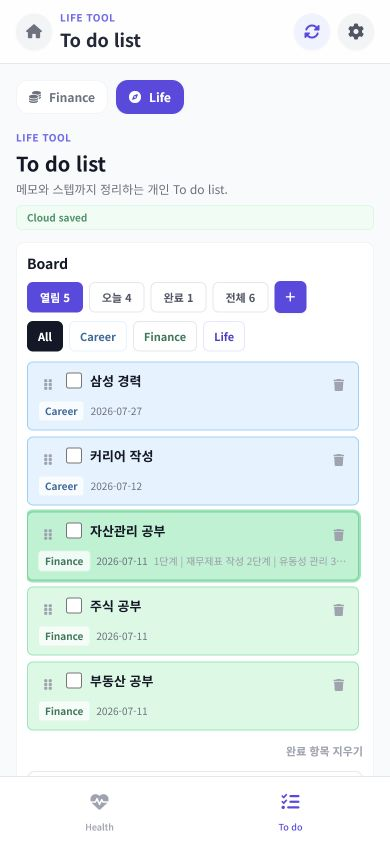

## 14. 최종 우선순위

1. 익명 CRUD 제거와 로그인/RLS 복원
2. TS를 실제 런타임으로 만들고 CFO 중복 제거
3. 객체 기반 repository와 전역 상태 축소
4. 순자산·현금흐름 지표 정의/기준일 통일
5. Finance Home을 Decision Inbox 중심으로 재구성
6. Life Home을 Today와 프로젝트 실행 화면으로 재구성
7. Todo 반복·알림·프로젝트 연결
8. 모바일 CFO를 그래프 대신 요약/목록 우선으로 제공
9. 테스트와 성능 계측을 기능 완료 조건으로 고정
