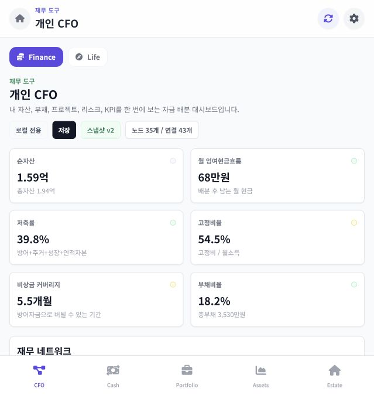
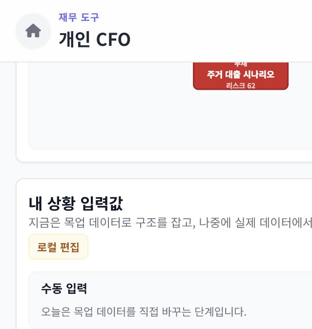
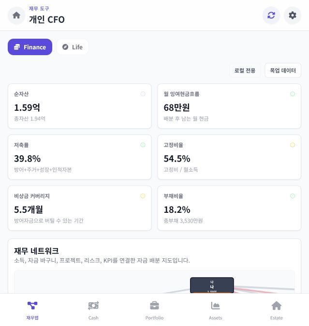
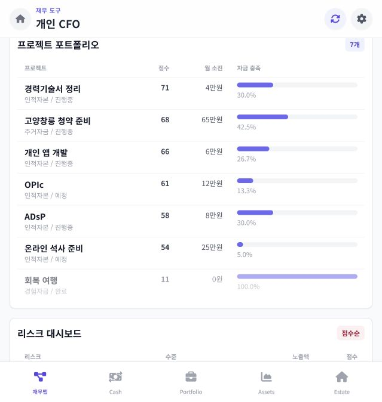
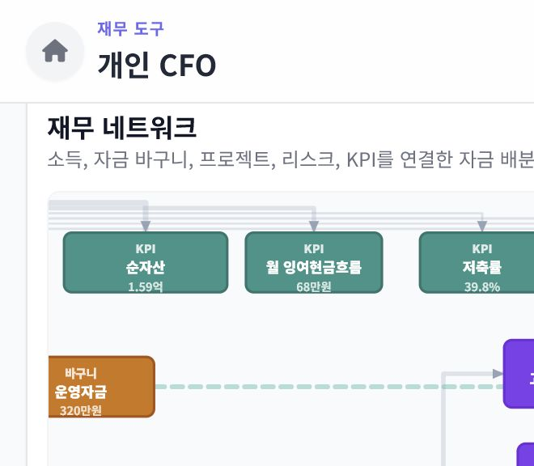

# Personal CFO 화면 검토

- 검토일: 2026-07-14
- 범위: 개인 CFO 요약, 재무 네트워크, 프로젝트 포트폴리오, 리스크 대시보드
- 사용자 목표: 중요한 재무 상태를 빠르게 읽고, 상세 데이터 입력은 별도 흐름으로 미룬다.

## 화면 단계

1. 개선 전 상단: KPI 우선순위는 명확했지만 중복 제목과 상태 배지가 첫 화면의 밀도를 높였다. 상태: 보통.
2. 개선 전 입력 영역: 대시보드 중간에 90개 입력 컨트롤이 노출되어 읽기 흐름과 모바일 스크롤을 크게 방해했다. 상태: 개선 필요.
3. 개선 후 상단: 앱 셸 제목을 유지하고 동기화 상태와 목업 여부만 남겨 KPI가 바로 보인다. 상태: 양호.
4. 개선 후 상세: 네트워크 다음에 점수순 프로젝트와 리스크 표가 이어지며, 입력 폼 없이 조회 흐름이 유지된다. 상태: 양호.

## 화면 증거

### 1. 개선 전 상단

### 2. 개선 전 입력 영역

### 3. 개선 후 상단

### 4. 개선 후 프로젝트와 리스크

## 이번 수정

- `내 상황 입력값`과 관련 입력 렌더링, 이벤트, 저장 버튼을 제거했다.
- 앱 셸과 중복되던 내부 제목, 스냅샷 버전, 노드·연결 개수 배지를 제거했다.
- 모바일에서는 그래프 범례를 숨기고 그래프 높이를 줄였다.
- KPI 그래프 노드와 연결의 `%`, `개월`, `원` 단위를 데이터 타입에 맞게 표시한다.
- KPI 상태 점은 스크린 리더가 읽지 않도록 장식 요소로 처리했다.

## 남은 우선순위

1. `주거 대출 시나리오`가 실제 부채 KPI에 포함된다. 부채에 `actual/scenario` 구분을 추가하기 전까지 순자산과 부채비율은 시나리오 값의 영향을 받는다.
2. 계산과 그래프 생성 로직이 TypeScript 모듈과 브라우저 JavaScript에 중복되어 좌표와 동작이 어긋날 수 있다. 한 구현을 빌드 산출물로 사용해야 한다.
3. 35개 노드를 고정 좌표로 한 번에 보여준다. 데이터 증가 전 타입 필터, 선택 상세, 자동 레이아웃 중 하나를 정해야 한다.
4. 계산 함수의 단위 테스트와 로그인 사용자별 클라우드 동기화 브라우저 테스트가 없다.
5. 그래프 노드는 키보드로 탐색할 수 없다. 계좌·자산·부채를 읽을 수 있는 대체 목록 또는 포커스 가능한 노드가 필요하다.

## 검증 한계

- 저장된 화면 증거는 639x674 모바일 뷰포트 기준이다.
- 1280x800에서는 DOM 위치, 카드 6개, 입력 영역 제거를 확인했지만 브라우저 캡처 배율 문제로 데스크톱 이미지는 증거에서 제외했다.
- 스크린샷만으로 키보드 이동, 스크린 리더 출력, 정확한 색 대비 충족 여부까지 판정하지 않았다.

## 직교 그래프 레이아웃

- 노드를 1400x720 그리드의 고정 행과 열에 배치했다.
- 계좌와 연결된 자금 바구니는 같은 행에 맞췄다.
- 연결선은 노드 중심 대각선 대신 노드 가장자리 포트를 잇는 90도 직교 경로를 사용한다.
- KPI는 상단 수평 행, 프로젝트와 리스크는 오른쪽 세로 열에 배치했다.
- 자금 바구니와 이미 연결된 리스크의 중복 노출 연결 5개를 제거했다.
- 화살촉 크기를 선 굵기와 분리하고 연결선 최대 굵기를 4.5 이하로 제한했다.

