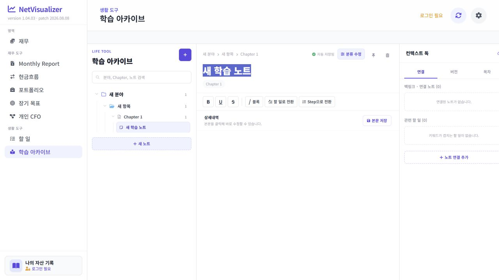

# Learning Archive Editor Combined Audit

## Scope

- Surface: Learning Archive note detail editor
- Goal: Create and revise a multi-line study note with mouse, keyboard, formatting, checklist, and save controls.
- Accessibility target: A single labelled multiline editor with predictable keyboard movement and operable checklist controls.

## Step 1 — Enter Learning Archive

Health: Good. The empty state and `새 노트` entry point are visible. The large unused right-hand area is expected until a note is selected.

## Step 2 — Open an editable note

Health: At risk before the patch. `상세내역` and `본문 저장` were discoverable, but each rendered line was its own editing host.

## Step 3 — Reproduce interaction failures

Health: Broken before the patch. Browser interaction evidence confirmed that clicking the first line left the caret in the second line, and ArrowUp/ArrowDown did not cross line boundaries. The screenshot shows the exact two-line state used for the interaction test; caret behavior itself was verified from the live selection state.

## Step 4 — Verify the stabilized editor

Health: Good after the patch. The note body is one multiline editing host. Click placement, vertical/horizontal movement, Home/End, Enter, Backspace/Delete, Tab/Shift+Tab, bold formatting, checklist conversion/toggle, live character count, autosave, and explicit body save were exercised successfully.

## Findings

### Strengths

- The three-column Learning Archive layout remains compact and visually consistent.
- Metadata editing remains separate from body editing.
- The body editor is labelled as a multiline textbox.
- Checklist state is exposed with `role="checkbox"` and `aria-checked`.

### UX risks fixed

- Isolated per-line editors blocked normal caret navigation.
- Native click placement was not reliable on rendered line content.
- Home/End and line-boundary Left/Right behavior were inconsistent.
- Backspace/Delete did not provide symmetric line merging.
- Character count became stale during structural edits.
- Native form checkboxes were unreliable inside a contenteditable surface.

### Accessibility risks fixed

- The editor now has one keyboard focus target instead of many nested editing hosts.
- Arrow and boundary keys have deterministic behavior across logical lines.
- Checkbox completion is keyboard-focusable and exposes checked state semantically.

## Evidence limits

- Screenshots alone cannot prove caret position or keyboard behavior; those were verified against the live selection and serialized note state.
- This audit does not claim full WCAG conformance or screen-reader certification.
